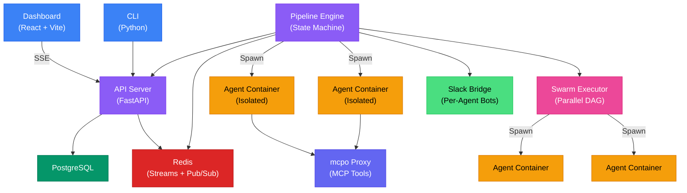

<div align="center">

# DjinnBot

**Autonomous AI teams that build software while you sleep.**

[](LICENSE)
[](https://pypi.org/project/djinn-bot-cli/)
[](docker-compose.yml)
[](https://docs.djinn.bot)

Deploy a full team of AI agents — product owner, architect, engineers, QA, SRE, executive assistant — that collaborate to spec, design, implement, review, test, and deploy your software. Each agent has a distinct persona, persistent memory, and its own Slack presence. Define a task, and watch your AI team work.

Self-hosted is free. One command to install, one command to run.

[**Join the Waitlist for DjinnBot Cloud**](https://app.djinn.bot) ·
[**Documentation**](https://docs.djinn.bot) ·
[**GitHub**](https://github.com/BaseDatum/djinnbot)

</div>

---

## Why DjinnBot

Most AI coding tools give you a chatbot with a terminal. DjinnBot gives you an **autonomous engineering organization** — a team of specialized agents that plan, build, review, test, and deploy software together, 24/7, without you sitting at the keyboard.

Here's what makes it different:

- **One command to run.** `curl` the installer. Answer a few questions. Your AI team is running in under 5 minutes. No Kubernetes, no cloud accounts, no 45-minute setup guides.

- **Real team, not a chatbot.** 11 agents with rich personas, opinions, and domain expertise. Eric (Product Owner) pushes back on vague specs. Finn (Architect) rejects PRs that violate architecture. Chieko (QA) finds the edge cases you forgot. Grace (Executive Assistant) tracks your commitments and never lets a follow-up slip.

- **Fully containerized.** Every agent runs in its own isolated Docker container with a complete engineering toolbox — Node 22, Python 3, Go, Rust, git, ripgrep, GitHub CLI, and dozens more. No host access. No security concerns. The container is destroyed after every step.

- **Persistent memory that actually works.** Agents remember decisions, lessons, and patterns across runs using ClawVault with semantic search. They build a linked knowledge graph over time. Memory scoring automatically surfaces the most relevant context. A 3D interactive graph lets you explore how your team's knowledge connects.

- **Swarm execution.** Run multiple agents in parallel on DAG-aware task graphs. A planning agent decomposes the work, and a swarm of agents executes it concurrently — respecting dependency chains, streaming progress in real-time, and converging on completion.

- **Beautiful, real-time dashboard.** Not a terminal dump. Live SSE-streamed activity feeds, kanban project boards, interactive pipeline visualizations, swarm DAG views, 3D memory graphs, per-user usage tracking, and a full admin panel. File uploads, image attachments, and inline HTML previews in chat.

- **Slack-native.** Each agent gets its own Slack bot. Watch your team discuss in threads. Mention an agent to get their perspective. Or skip Slack entirely and use the built-in chat.

- **Full cost visibility.** Every LLM API call is logged with token counts, latency, cost, and which API key was used. Per-user usage dashboards. Admin-level API usage panels with provider breakdowns. Know exactly what your AI team costs.

- **Enterprise-ready auth.** Multi-user accounts, TOTP two-factor authentication, API keys, OIDC single sign-on, per-user provider key sharing, and automatic SSL via Let's Encrypt. Not an afterthought — built in from the start.

---

## Quick Start

### One-Line Install

```bash
curl -fsSL https://raw.githubusercontent.com/BaseDatum/djinnbot/main/install.sh | bash
```

The installer handles everything — Docker, Python, the CLI, cloning the repo, generating secrets, configuring your model provider, optional SSL, and starting the stack. Works on **Linux** (Ubuntu, Debian, Fedora, CentOS, Arch, Amazon Linux) and **macOS** (Intel and Apple Silicon).

### Manual Install

```bash
git clone https://github.com/BaseDatum/djinnbot.git && cd djinnbot
cp .env.example .env
# Add your API key: OPENROUTER_API_KEY=sk-or-v1-your-key-here
docker compose up -d
```

### First Visit

| Service | URL |
|---------|-----|
| Dashboard | `http://localhost:3000` |
| API | `http://localhost:8000` |
| MCP Tools | `http://localhost:8001` |

> When authentication is enabled (`AUTH_ENABLED=true`), the dashboard redirects you to a setup page on first visit where you create your admin account and optionally enable two-factor authentication.

### CLI

```bash
pip install djinn-bot-cli
djinn setup          # interactive setup wizard (safe to re-run)
djinn login          # email/password + optional 2FA
djinn chat           # interactive agent + model selection
djinn provider list  # see configured LLM providers
```

See the [CLI reference](https://docs.djinn.bot/docs/reference/cli/) for all commands.

---

## How It Works


1. **Create a project** — describe what you want built via the guided onboarding, or import an existing repo
2. **Plan it** — the planning pipeline decomposes your project into tasks on a kanban board with priorities, dependencies, and hour estimates
3. **Agents claim tasks** — each agent watches specific board columns matching their role. Yukihiro grabs implementation work. Chieko grabs review tasks.
4. **Autonomous work** — on pulse cycles, agents wake up, claim a task, spin up an isolated container, write code, run tests, and open a PR
5. **Review & iterate** — Finn reviews the PR. If changes are needed, the task cycles back. If approved, Chieko runs tests.
6. **Ship it** — Stas handles deployment. Watch the whole thing happen in real-time via the dashboard, Slack, or the live activity feed.

For structured one-off workflows, run **pipelines** directly — engineering (full SDLC), feature, bugfix, or planning. Or create custom YAML pipelines for any repeatable process.

For maximum throughput, use **swarm execution** — a parallel execution engine that runs multiple agents concurrently on DAG-aware task graphs, respecting dependency chains and streaming progress live.

---

## The Team

DjinnBot ships with 11 agents covering a full product organization:

### Engineering

| Agent | Role | What They Do |
|-------|------|-------------|
| **Eric** | Product Owner | Requirements, user stories, acceptance criteria, scope management |
| **Finn** | Solutions Architect | System architecture, tech decisions, code review, API design |
| **Shigeo** | UX Specialist | User flows, design systems, component specs, accessibility |
| **Yukihiro** | Senior SWE | Implementation, bug fixes, writing production code |
| **Chieko** | Test Engineer | QA strategy, regression detection, test automation |
| **Stas** | SRE | Infrastructure, deployment, monitoring, incident response |
| **Yang** | DevEx Specialist | CI/CD pipelines, tooling, developer workflow optimization |

### Business & Operations

| Agent | Role | What They Do |
|-------|------|-------------|
| **Grace** | Executive Assistant | Meeting transcript processing, commitment tracking, relationship management, proactive follow-ups |
| **Holt** | Marketing & Sales | Sales strategy, outreach, deal management, positioning |
| **Luke** | SEO Specialist | Content strategy, keyword research, technical SEO |
| **Jim** | Finance Lead | Budget, pricing, runway management, financial modeling |

> Agents are not generic LLM wrappers. Each has a 100-200 line personality file with backstory, core beliefs, productive flaws, anti-patterns, and collaboration triggers. Eric cuts scope aggressively (sometimes too aggressively). Finn over-engineers (but catches problems others miss). Yukihiro refuses to ship without tests (even when deadlines are tight).

---

## Architecture



**Services:** PostgreSQL (state), Redis (event bus via Streams + Pub/Sub), FastAPI (REST API + SSE), Pipeline Engine (state machine + container orchestration), Dashboard (React SPA), mcpo (MCP tool proxy), Slack Bridge (per-agent Socket Mode bots).

**Agent containers** are ephemeral Docker environments with a full engineering toolbox (Node 22, Python 3, Go, Rust, 30+ dev tools). Created per step, destroyed on completion. No host access.

---

## Key Features

<details>
<summary><strong>Swarm Execution</strong> — parallel multi-agent task processing</summary>

Run multiple agents concurrently on DAG-aware task graphs. The planning agent decomposes work into a dependency graph, and the swarm executor schedules tasks across agents in parallel — respecting dependency chains, handling failures, and streaming progress via SSE. Watch it all unfold in the swarm DAG visualization.

</details>

<details>
<summary><strong>Persistent Memory + Knowledge Graph</strong> — agents that learn and remember</summary>

Every agent has a personal memory vault plus access to shared team knowledge. Memories are stored as linked markdown entries connected via `[[wiki-links]]` for graph traversal. Semantic search via QMDR finds memories by meaning, not keywords. Memory scoring automatically weights relevance by recency, frequency, and importance. Explore the knowledge graph in an interactive 3D visualization powered by Three.js/WebGL.

</details>

<details>
<summary><strong>Named Pulse Routines</strong> — fully customizable autonomous behavior</summary>

Each agent can have multiple named pulse routines with independent schedules, models, and behavior. A QA agent might run a "PR Review" routine every 30 minutes and a "Regression Scan" routine nightly. Routines are defined as markdown files — write whatever instructions you want and the agent follows them. Configurable blackout windows, stagger offsets, and wake guardrails prevent resource contention.

</details>

<details>
<summary><strong>Agent Coordination</strong> — structured multi-agent collaboration</summary>

Agents communicate through a two-tier messaging system: a work ledger for task coordination and an inbox for direct messages. Wake guardrails prevent infinite loops (cooldown periods, daily session caps, per-pair limits). Concurrent pulse session limits prevent resource exhaustion. The coordination system ensures agents work together effectively without stepping on each other.

</details>

<details>
<summary><strong>LLM Usage Tracking</strong> — complete cost visibility</summary>

Every LLM API call is logged with provider, model, input/output/cache token counts, latency, estimated cost, and which API key was used (system vs. user-provided). Real-time SSE-driven usage dashboards for both users and admins. Per-provider breakdowns. Know exactly what your AI team costs, per agent, per run, per user.

</details>

<details>
<summary><strong>Admin Panel</strong> — full operational control</summary>

A dedicated admin interface with container log streaming, LLM call logs with filtering and search, API usage analytics per provider, system notifications, user management, and real-time health monitoring. Pull missing Docker images from the admin panel. View and manage all user accounts, API keys, and provider configurations.

</details>

<details>
<summary><strong>Per-User API Key Sharing</strong> — bring your own keys</summary>

Users can configure their own LLM provider API keys that take priority over system-wide keys. Key resolution tracking shows exactly which key was used for every session — system-provided, user-provided, or agent-override. Admins can enforce share limits and monitor usage per user.

</details>

<details>
<summary><strong>File Uploads & Attachments</strong> — rich context in chat</summary>

Upload files and images directly into chat sessions. Text is automatically extracted from PDFs and documents. Images are passed as vision inputs to multimodal models. All attachments are stored securely and scoped to the session.

</details>

---

## Pipelines

| Pipeline | Description |
|----------|------------|
| `engineering` | Full SDLC: spec → design → UX → implement → review → test → deploy |
| `feature` | Lightweight: design → implement → review → test |
| `bugfix` | Focused: diagnose → fix → validate |
| `planning` | Two-stage project decomposition: high-level breakdown → validated subtasks |
| `execute` | Run a single task from a project board |

Pipelines are YAML files with steps, template variables, conditional branching, loops, structured output schemas, retries, and per-step model overrides. Drop a YAML file in `pipelines/` and it appears in the dashboard instantly — no restart needed.

---

## Agent Anatomy

```
agents/eric/
├── IDENTITY.md      # Name, origin, role, emoji
├── SOUL.md          # Personality, beliefs, anti-patterns, communication style
├── AGENTS.md        # Workflow procedures, collaboration triggers, tools
├── DECISION.md      # Memory-first decision framework
├── PULSE.md         # Autonomous wake-up routine
├── config.yml       # Model, pulse schedule, thinking, coordination settings
└── slack.yml        # Slack bot credentials (optional)
```

Create a new agent by adding a directory under `agents/`. Define their personality in markdown. Set their model and schedule in YAML. Restart the engine. That's it — no code required.

---

## LLM Providers

DjinnBot supports all major providers through [pi-mono](https://github.com/badlogic/pi-mono):

| Provider | Env Variable | Notes |
|----------|-------------|-------|
| **OpenRouter** (recommended) | `OPENROUTER_API_KEY` | One key, every model. Simplest setup. |
| Anthropic | `ANTHROPIC_API_KEY` | Claude Sonnet, Opus, Haiku |
| OpenAI | `OPENAI_API_KEY` | GPT-4o, o1, o3 |
| Google | `GEMINI_API_KEY` | Gemini 2.5 Pro, Flash |
| xAI | `XAI_API_KEY` | Grok 4 |
| Groq | `GROQ_API_KEY` | Fast inference |
| Mistral | `MISTRAL_API_KEY` | Mistral Large, Codestral |
| Azure OpenAI | `AZURE_OPENAI_API_KEY` | Enterprise Azure deployments |
| Amazon Bedrock | AWS credentials | Claude, Llama, Titan |
| Google Vertex | GCP ADC | Gemini, PaLM |
| Custom (OpenAI-compatible) | Via settings UI | Ollama, vLLM, LM Studio, etc. |

Each agent can use a different model. Put your architect on Claude Opus and your engineer on Kimi K2.5. Override per-pipeline-step. Users can bring their own API keys.

---

## How DjinnBot Compares

|  | **DjinnBot** | **Single-Agent Tools** | **Agent Frameworks** |
|--|:------------|:----------------------|:--------------------|
| **Setup** | One `curl` command — 5 min | Install IDE extension | Hours of framework wiring |
| **Agents** | 11 specialized agents with rich personas | One generic assistant | Build your own from scratch |
| **Security** | Container isolation, 2FA, encrypted secrets, auto SSL | Direct host access | Direct host access |
| **Memory** | Persistent semantic memory + knowledge graph | Stateless or basic files | Stateless or basic files |
| **Collaboration** | Agents review, critique, and build on each other's work | Single agent, single perspective | Custom-coded coordination |
| **Visibility** | Real-time dashboard, Slack, live feeds, usage tracking | Terminal output | Minimal web UI |
| **Customization** | YAML pipelines + markdown personas, no code | Limited to tool config | Full code changes |
| **Autonomy** | Agents work 24/7 on pulse schedules | Requires human in the loop | Requires human in the loop |
| **Cost tracking** | Per-call, per-agent, per-user LLM usage logs | None | None |

---

## Tech Stack

| Component | Technology |
|-----------|-----------|
| Pipeline Engine | TypeScript, Redis Streams, custom state machine |
| API Server | Python, FastAPI, PostgreSQL, SQLAlchemy, JWT auth |
| Dashboard | React, Vite, TanStack Router, Tailwind CSS, Three.js |
| Agent Runtime | Node.js 22, Debian bookworm (full toolbox) |
| Memory | ClawVault + QMDR (semantic search + knowledge graph) |
| Agent Framework | pi-mono (pi-agent-core) |
| Slack | Bolt.js, Socket Mode, per-agent bots |
| MCP Proxy | mcpo (hot-reload) |
| CLI | Python, Rich TUI, PyPI distribution |
| Build | Turborepo monorepo |
| Orchestration | Docker Compose |

---

<details>
<summary><strong>Project Structure</strong></summary>

```
djinnbot/
├── agents/                     # Agent persona definitions
│   ├── _templates/             # Shared workflow templates
│   ├── _skills/                # Global skills (available to all agents)
│   ├── eric/                   # Product Owner
│   ├── finn/                   # Solutions Architect
│   ├── shigeo/                 # UX Specialist
│   ├── yukihiro/               # Senior SWE
│   ├── chieko/                 # Test Engineer
│   ├── stas/                   # SRE
│   ├── yang/                   # DevEx
│   ├── grace/                  # Executive Assistant
│   ├── holt/                   # Marketing & Sales
│   ├── luke/                   # SEO
│   └── jim/                    # Finance
├── pipelines/                  # YAML pipeline definitions
├── skills/                     # Skill packages with references and templates
├── packages/
│   ├── core/                   # Engine, events, memory, containers, swarms
│   ├── server/                 # FastAPI API server (Python)
│   ├── dashboard/              # React dashboard (TypeScript)
│   ├── slack/                  # Slack bridge and per-agent bots
│   └── agent-runtime/          # Agent container entrypoint + tools
├── mcp/                        # MCP tool server config
├── cli/                        # Python CLI (pip install djinn-bot-cli)
├── proxy/                      # Traefik reverse proxy for SSL
├── dialog/                     # Dialog submodule (Grace integration)
├── install.sh                  # One-shot installer script
├── docker-compose.yml          # Primary compose file
└── docker-compose.ghcr.yml     # Pre-built image compose file
```

</details>

<details>
<summary><strong>Development Setup</strong></summary>

**Requirements:** Node.js 20+, Python 3.12+, PostgreSQL, Redis

```bash
# Install dependencies
npm install
cd packages/server && pip install -e ".[dev]" && cd ../..
cd cli && uv sync --all-extras && cd ..

# Start infrastructure
docker compose up -d postgres redis

# Run API server
cd packages/server && uvicorn app.main:app --reload --port 8000

# Run engine (separate terminal)
cd packages/core && npm run build && node dist/main.js

# Run dashboard (separate terminal)
cd packages/dashboard && npm run dev
```

</details>

---

## Roadmap

- **RBAC & team management** — role-based access control with granular permissions
- **Marketing & sales pipelines** — structured workflows for content, outreach, and deals
- **Discord & Teams** — bot interfaces beyond Slack
- **Pipeline marketplace** — share and discover community pipeline templates
- **Custom agent builder** — create agents with custom personas through the dashboard UI
- **SaaS offering** — managed hosting at djinn.bot

---

## License

[FSL-1.1-ALv2](LICENSE) — Functional Source License with Apache 2.0 future grant.

**What this means:** Use it, modify it, self-host it for free. The only restriction is you can't use it to build a competing commercial product. After 2 years, every release automatically converts to Apache 2.0 with no restrictions.

---

<div align="center">

**[Join the Waitlist](https://app.djinn.bot)** · **[Documentation](https://docs.djinn.bot)** · **[GitHub](https://github.com/BaseDatum/djinnbot)**

Built by [Sky Moore](https://github.com/skymoore) and the DjinnBot team.

</div>
