<div align="center">

# DjinnBot

**Autonomous AI teams that can do anything.**

[](LICENSE)
[](https://pypi.org/project/djinn-bot-cli/)
[](docker-compose.yml)
[](https://docs.djinn.bot)

Deploy a team of AI agents that collaborate autonomously — engineering, research, content, operations, finance, or any workflow you define. Each agent has a distinct persona, persistent memory, a full toolbox inside an isolated container, and can be reached from Slack, Discord, Telegram, WhatsApp, Signal, or the built-in chat. Self-hosted and free.

[**Join the Waitlist for DjinnBot Cloud**](https://app.djinn.bot) ·
[**Documentation**](https://docs.djinn.bot) ·
[**GitHub**](https://github.com/BaseDatum/djinnbot)

</div>

---

## Why DjinnBot

Most AI tools give you a chatbot with a terminal. DjinnBot gives you an **autonomous team** — specialized agents that plan, build, review, research, and deliver together, 24/7, without you sitting at the keyboard.

Here's what makes it different:

- **40x token efficiency.** Other tools waste 20,000 tokens reading files to understand a single function. DjinnBot's [Code Knowledge Graph](https://docs.djinn.bot/docs/concepts/code-knowledge-graph/) does it in 500. [Programmatic Tool Calling](https://docs.djinn.bot/docs/concepts/programmatic-tool-calling/) replaces 30 verbose JSON schemas with compact Python signatures. `focused_analysis` delegates to sub-models so the agent's context stays clean. Your agents do more work per dollar of context.

- **Full cost visibility.** Every LLM API call logged with model, tokens, latency, cost, and who triggered it. Per-user and per-agent dashboards. Provider-level breakdowns. You will never wonder where the money went.

- **One command to run.** `curl` the installer. Answer a few questions. Your AI team is running in under 5 minutes. No Kubernetes, no cloud accounts, no 45-minute setup guides.

- **Real team, not a chatbot.** 11 agents with rich personas, opinions, and domain expertise. Eric (Product Owner) pushes back on vague specs. Finn (Architect) rejects PRs that violate architecture. Grace (Executive Assistant) tracks your commitments and never lets a follow-up slip. Or create your own agents for any domain by adding a directory with a few markdown files.

- **Fully containerized.** Every agent runs in its own isolated Docker container with a complete toolbox — Node 22, Python 3, Go, Rust, an anti-detection browser (Camoufox), git, ripgrep, GitHub CLI, and dozens more. No host access. The container is destroyed after every step.

- **Persistent memory that actually works.** Agents remember decisions, lessons, and patterns across runs using ClawVault with semantic search. They build a linked knowledge graph over time. Memory scoring automatically surfaces the most relevant context. A 3D interactive graph lets you explore how your team's knowledge connects.

- **Swarm execution.** Run multiple agents in parallel on DAG-aware task graphs. A planning agent decomposes the work, and a swarm of agents executes it concurrently — respecting dependency chains, streaming progress in real-time, and converging on completion.

- **Beautiful, real-time dashboard.** Not a terminal dump. Live SSE-streamed activity feeds, kanban project boards, interactive pipeline visualizations, swarm DAG views, Sigma.js code graph visualizations, 3D memory graphs, per-user usage tracking, and a full admin panel.

- **Message from any app.** Talk to your agents from Slack, Discord, Telegram, WhatsApp, or Signal — whatever your team already uses. Each agent gets its own bot identity on per-agent platforms (Slack, Discord, Telegram), and Signal/WhatsApp use a shared number with smart routing. Or use the built-in dashboard chat and CLI.

- **Enterprise-ready auth.** Multi-user accounts, TOTP two-factor authentication, API keys, OIDC single sign-on, per-user provider key sharing, and automatic SSL via Let's Encrypt. Built in from the start.

---

## Quick Start

### One-Line Install

```bash
curl -fsSL https://raw.githubusercontent.com/BaseDatum/djinnbot/main/install.sh | bash
```

The installer handles everything — Docker, Python, the CLI, cloning the repo, generating secrets, configuring your model provider, optional SSL, and starting the stack. Works on **Linux** (Ubuntu, Debian, Fedora, CentOS, Arch, Amazon Linux) and **macOS** (Intel and Apple Silicon).

### Manual Install (Build from Source)

```bash
git clone https://github.com/BaseDatum/djinnbot.git && cd djinnbot
cp .env.example .env
# Add your API key: OPENROUTER_API_KEY=sk-or-v1-your-key-here
docker compose up -d
```

### Pre-Built Images (Faster)

Skip the build step entirely using pre-built GHCR images:

```bash
git clone https://github.com/BaseDatum/djinnbot.git && cd djinnbot
cp .env.example .env
# Add your API key: OPENROUTER_API_KEY=sk-or-v1-your-key-here
COMPOSE_FILE=docker-compose.ghcr.yml docker compose up -d
```

### First Visit

| Service   | URL                     |
| --------- | ----------------------- |
| Dashboard | `http://localhost:3000` |
| API       | `http://localhost:8000` |
| MCP Tools | `http://localhost:8001` |

> When authentication is enabled (`AUTH_ENABLED=true`), the dashboard redirects you to a setup page on first visit where you create your admin account and optionally enable two-factor authentication.

### CLI

```bash
pip install djinn-bot-cli
djinn setup          # interactive setup wizard (safe to re-run)
djinn login          # email/password + optional 2FA
djinn chat           # interactive agent + model selection
djinn cookies export # export cookies from your browser for agent browsing
djinn provider list  # see configured LLM providers
djinn update         # pull latest images and restart the stack
```

See the [CLI reference](https://docs.djinn.bot/docs/reference/cli/) for all commands.

---

## How It Works


1. **Define the work** — describe what you need via the guided onboarding, chat, or API. Software projects, research tasks, content campaigns, operations workflows — anything.
2. **Plan it** — the planning pipeline decomposes your project into tasks on a kanban board with priorities, dependencies, and hour estimates. Choose structured planning or agentic planning for large projects.
3. **Agents claim tasks** — each agent watches specific board columns matching their role. Engineers grab implementation work. Reviewers grab review tasks. Any agent can be configured to watch any column.
4. **Autonomous work** — on pulse cycles, agents wake up, claim a task, spin up an isolated container, and do the work — writing code, researching topics, generating content, browsing the web, or running any tools you've given them.
5. **Review & iterate** — agents review each other's work. If changes are needed, the task cycles back. They coordinate via inbox messages and can wake each other for urgent blockers.
6. **Deliver** — watch the whole thing happen in real-time via the dashboard, Slack, Discord, Telegram, WhatsApp, Signal, CLI, or the live activity feed.

For maximum throughput, use **swarm execution** — a parallel execution engine that runs multiple agents concurrently on DAG-aware task graphs, respecting dependency chains and streaming progress live.

---

## More Done, Less Context

Most agent tools burn through context windows by dumping raw file contents and verbose JSON schemas into every turn. DjinnBot is engineered to minimize token waste:

| Task                                        | Typical Agent Tool                         | DjinnBot                                   | Reduction |
| ------------------------------------------- | ------------------------------------------ | ------------------------------------------ | --------- |
| Understand a function + all callers/callees | ~20,000 tokens (15+ file reads)            | ~500 tokens (1 `code_graph_context` call)  | **40x**   |
| "What breaks if I change AuthService?"      | ~30,000 tokens (codebase-wide grep + read) | ~800 tokens (1 `code_graph_impact` call)   | **37x**   |
| 30 tool schemas in system prompt            | ~18,000 tokens (full JSON schemas)         | ~1,500 tokens (compact Python signatures)  | **12x**   |
| Read 5 files, grep, aggregate               | ~12,000 tokens (5 round-trips)             | ~500 tokens (1 `exec_code` call)           | **24x**   |
| Analyze a 500-line diff                     | ~4,000 tokens (in agent context)           | ~300 tokens (`focused_analysis` sub-model) | **13x**   |

Three systems make this possible:

- **[Code Knowledge Graph](https://docs.djinn.bot/docs/concepts/code-knowledge-graph/)** — Tree-sitter parses source files into a graph of functions, classes, call chains, and functional clusters stored in KuzuDB. Agents query the graph instead of reading files. Supports TypeScript, JavaScript, Python, Go, Rust, Java, C, C++, C#, and PHP.

- **[Programmatic Tool Calling](https://docs.djinn.bot/docs/concepts/programmatic-tool-calling/)** — Instead of 30 full JSON schemas in every prompt, agents get compact Python function signatures and write code that calls tools, loops, and aggregates. Only the final result enters the context window.

- **Focused Analysis** — `focused_analysis` delegates analytical questions to a fast sub-model with persona support (analyst, security, reviewer, architect, tester). The agent's context stays clean for high-level reasoning.

---

## The Team

DjinnBot ships with 11 agents covering a full product organization:

### Engineering

| Agent        | Role                | What They Do                                                      |
| ------------ | ------------------- | ----------------------------------------------------------------- |
| **Eric**     | Product Owner       | Requirements, user stories, acceptance criteria, scope management |
| **Finn**     | Solutions Architect | System architecture, tech decisions, code review, API design      |
| **Shigeo**   | UX Specialist       | User flows, design systems, component specs, accessibility        |
| **Yukihiro** | Senior SWE          | Implementation, bug fixes, writing production code                |
| **Chieko**   | Test Engineer       | QA strategy, regression detection, test automation                |
| **Stas**     | SRE                 | Infrastructure, deployment, monitoring, incident response         |
| **Yang**     | DevEx Specialist    | CI/CD pipelines, tooling, developer workflow optimization         |

### Business & Operations

| Agent     | Role                | What They Do                                                                                      |
| --------- | ------------------- | ------------------------------------------------------------------------------------------------- |
| **Grace** | Executive Assistant | Meeting transcript processing, commitment tracking, relationship management, proactive follow-ups |
| **Holt**  | Marketing & Sales   | Sales strategy, outreach, deal management, positioning                                            |
| **Luke**  | SEO Specialist      | Content strategy, keyword research, technical SEO                                                 |
| **Jim**   | Finance Lead        | Budget, pricing, runway management, financial modeling                                            |

> Agents are not generic LLM wrappers. Each has a 100-200 line personality file with backstory, core beliefs, productive flaws, anti-patterns, and collaboration triggers. The default team covers engineering, ops, marketing, SEO, and finance — but you can create agents for any domain by adding a directory with a few markdown files.

---

## Architecture

```mermaid
graph TB
    Dashboard["Dashboard<br/>(React + Vite)"] -->|SSE| API["API Server<br/>(FastAPI)"]
    CLI["CLI<br/>(Python)"] --> API
    API --> DB["PostgreSQL"]
    API --> Redis["Redis<br/>(Streams + Pub/Sub<br/>+ JuiceFS Metadata)"]
    Engine["Pipeline Engine<br/>(State Machine)"] --> API
    Engine --> Redis
    Engine -->|"Spawn"| Agent1["Agent Container<br/>(Isolated)"]
    Engine -->|"Spawn"| Agent2["Agent Container<br/>(Isolated)"]
    Engine --> Swarm["Swarm Executor<br/>(Parallel DAG)"]
    Swarm -->|"Spawn"| Agent3["Agent Container"]
    Swarm -->|"Spawn"| Agent4["Agent Container"]
    Agent1 --> mcpo["mcpo Proxy<br/>(MCP Tools)"]
    Agent2 --> mcpo
    Engine --> Slack["Slack Bridge"]
    Engine --> Discord["Discord Bridge"]
    Engine --> Telegram["Telegram Bridge"]
    Engine --> Signal["Signal Bridge"]
    Engine --> WhatsApp["WhatsApp Bridge"]
    JFS["JuiceFS FUSE Mount"] --> RustFS["RustFS<br/>(S3 Object Store)"]
    JFS --> Redis

    style Dashboard fill:#3b82f6,color:#fff,stroke:#2563eb
    style CLI fill:#3b82f6,color:#fff,stroke:#2563eb
    style API fill:#8b5cf6,color:#fff,stroke:#7c3aed
    style Engine fill:#8b5cf6,color:#fff,stroke:#7c3aed
    style Swarm fill:#ec4899,color:#fff,stroke:#db2777
    style DB fill:#059669,color:#fff,stroke:#047857
    style Redis fill:#dc2626,color:#fff,stroke:#b91c1c
    style Agent1 fill:#f59e0b,color:#000,stroke:#d97706
    style Agent2 fill:#f59e0b,color:#000,stroke:#d97706
    style Agent3 fill:#f59e0b,color:#000,stroke:#d97706
    style Agent4 fill:#f59e0b,color:#000,stroke:#d97706
    style mcpo fill:#6366f1,color:#fff,stroke:#4f46e5
    style Slack fill:#4ade80,color:#000,stroke:#22c55e
    style Discord fill:#5865F2,color:#fff,stroke:#4752C4
    style Telegram fill:#26A5E4,color:#fff,stroke:#1E96D1
    style Signal fill:#3A76F0,color:#fff,stroke:#2E62CC
    style WhatsApp fill:#25D366,color:#fff,stroke:#1DA851
    style JFS fill:#14b8a6,color:#fff,stroke:#0d9488
    style RustFS fill:#14b8a6,color:#fff,stroke:#0d9488
```



**Services:** PostgreSQL (state), Redis (event bus via Streams + Pub/Sub, JuiceFS metadata), FastAPI (REST API + SSE), Pipeline Engine (state machine + container orchestration), Dashboard (React SPA), mcpo (MCP tool proxy), Messaging Bridges (Slack, Discord, Telegram, Signal, WhatsApp), JuiceFS + RustFS (shared POSIX filesystem).

**Agent containers** are ephemeral Docker environments with a full toolbox (Node 22, Python 3, Go, Rust, Camoufox browser, 30+ dev tools). Created per step, destroyed on completion. No host access. Programmatic Tool Calling reduces context usage by 30-40%+.

---

## Key Features

<details>
<summary><strong>Code Knowledge Graph</strong> — structural codebase understanding for agents</summary>

Tree-sitter parses every source file into a graph of functions, classes, call chains, and functional clusters stored in KuzuDB. Agents query the graph with four tools: `code_graph_query` (search), `code_graph_context` (symbol deep-dive), `code_graph_impact` (change risk analysis), and `code_graph_changes` (pre-commit safety check). Supports 10 languages. Interactive Sigma.js visualization in the dashboard. One tool call replaces 15+ file reads.

</details>

<details>
<summary><strong>Programmatic Tool Calling</strong> — 12x context reduction on tool schemas</summary>

Instead of sending 30 full JSON tool schemas in every prompt, PTC gives agents a single `exec_code` tool with compact Python function signatures. Agents write code that calls tools, loops, filters, and aggregates — and only the final result enters the context window. Intermediate tool outputs never touch the LLM. Reduces prompt overhead by 12x and total context usage by 30-40%+.

</details>

<details>
<summary><strong>Camoufox Browser + Cookie Bridge</strong> — authenticated web browsing for agents</summary>

Agent containers include Camoufox, an anti-detection browser based on Firefox. Agents can browse sites that block standard HTTP clients. Upload cookies via the dashboard, CLI (`djinn cookies`), or the Chrome/Firefox Cookie Bridge extension. Grant cookie access per agent. Agents browse authenticated sites like a real user.

</details>

<details>
<summary><strong>Swarm Execution</strong> — parallel multi-agent task processing</summary>

Run multiple agents concurrently on DAG-aware task graphs. The planning agent decomposes work into a dependency graph, and the swarm executor schedules tasks across agents in parallel — respecting dependency chains, handling failures, and streaming progress via SSE. Watch it all unfold in the swarm DAG visualization.

</details>

<details>
<summary><strong>Persistent Memory + Knowledge Graph</strong> — agents that learn and remember</summary>

Every agent has a personal memory vault plus access to shared team knowledge. Memories are stored as linked markdown entries connected via `[[wiki-links]]` for graph traversal. Semantic search via QMDR finds memories by meaning, not keywords. Memory scoring automatically weights relevance by recency, frequency, and importance. Explore the knowledge graph in an interactive 3D visualization powered by Three.js/WebGL.

</details>

<details>
<summary><strong>Named Pulse Routines</strong> — fully customizable autonomous behavior</summary>

Each agent can have multiple named pulse routines with independent schedules, models, and behavior. A QA agent might run a "PR Review" routine every 30 minutes and a "Regression Scan" routine nightly. Routines are defined as markdown files — write whatever instructions you want and the agent follows them. Configurable blackout windows, stagger offsets, and wake guardrails prevent resource contention.

</details>

<details>
<summary><strong>Agent Coordination</strong> — structured multi-agent collaboration</summary>

Agents communicate through a two-tier messaging system: a work ledger for task coordination and an inbox for direct messages. Wake guardrails prevent infinite loops (cooldown periods, daily session caps, per-pair limits). Plan + Execute delegation lets a powerful planner model create a detailed brief, then spawn a cheaper executor in a fresh container with a clean context window.

</details>

<details>
<summary><strong>Focused Analysis</strong> — delegate without consuming context</summary>

`focused_analysis` sends a focused question + context to a fast sub-model and returns a compact result in 3-30 seconds. Five built-in personas (analyst, security, reviewer, architect, tester) shape the analysis. The agent's own context window stays clean for high-level reasoning — no 500-line diffs polluting the conversation history.

</details>

<details>
<summary><strong>PDF & Document Processing</strong> — structured knowledge from documents</summary>

Upload PDFs via chat or the API. OpenDataLoader extracts text with structural awareness. Content is chunked, indexed, and ingested into the shared ClawVault memory vault so every agent can recall document knowledge via semantic search. Agents access document content lazily via `read_document` — pulling only the sections they need instead of dumping entire PDFs into context.

</details>

<details>
<summary><strong>LLM Usage Tracking</strong> — complete cost visibility</summary>

Every LLM API call is logged with provider, model, input/output/cache token counts, latency, estimated cost, and which API key was used (system vs. user-provided). Real-time SSE-driven usage dashboards for both users and admins. Per-provider breakdowns. Know exactly what your AI team costs, per agent, per run, per user.

</details>

<details>
<summary><strong>Admin Panel</strong> — full operational control</summary>

A dedicated admin interface with container log streaming, LLM call logs with filtering and search, API usage analytics per provider, system notifications, user management, and real-time health monitoring. Pull missing Docker images from the admin panel. View and manage all user accounts, API keys, and provider configurations.

</details>

<details>
<summary><strong>Voice — STT & TTS</strong> — agents that listen and speak</summary>

Send voice messages on any channel and agents transcribe them via faster-whisper (4x faster than Whisper, runs on CPU). Agents can speak back — responses are synthesized to audio via Fish Audio (cloud, voice cloning) or Voicebox (self-hosted Qwen3-TTS, free). Per-agent voice selection, automatic format conversion for each platform (OGG/Opus for Telegram/WhatsApp/Discord, MP3 for Slack/Signal/dashboard), and full cost tracking in the admin panel.

</details>

---

## Pipelines

| Pipeline           | Description                                                               |
| ------------------ | ------------------------------------------------------------------------- |
| `engineering`      | Full SDLC: spec, design, UX, implement, review, test, deploy              |
| `planning`         | Structured two-stage project decomposition with validation                |
| `planning-agentic` | Single-agent planning with tool-based task creation and dependency wiring |
| `feature`          | Lightweight: design, implement, review, test                              |
| `bugfix`           | Focused: diagnose, fix, validate                                          |
| `resolve`          | GitHub issue to pull request: analyze, implement, test, PR                |
| `import`           | Onboard an existing repo: analyze codebase, create memories, generate backlog |
| `execute`          | Run a single task from a project board                                    |

Pipelines are YAML files with steps, template variables, conditional branching, loops, structured output schemas, retries, and per-step model overrides. Drop a YAML file in `pipelines/` and it appears in the dashboard instantly — no restart needed.

The **agentic planning pipeline** is designed for large projects where structured output hits token limits. It uses a single powerful model with full tool access to incrementally create tasks, subtasks, and dependency edges via API calls — with built-in cycle detection.

---

## Agent Anatomy

```
agents/eric/
├── IDENTITY.md      # Name, origin, role, emoji
├── SOUL.md          # Personality, beliefs, anti-patterns, communication style
├── AGENTS.md        # Workflow procedures, collaboration triggers, tools
├── DECISION.md      # Memory-first decision framework
├── PULSE.md         # Autonomous wake-up routine
├── config.yml       # Model, pulse schedule, thinking, coordination settings
├── slack.yml        # Slack bot credentials (optional)
├── discord.yml      # Discord bot credentials (optional)
└── telegram.yml     # Telegram bot credentials (optional)
```

Create a new agent by adding a directory under `agents/`. Define their personality in markdown. Set their model and schedule in YAML. Restart the engine. That's it — no code required.

---

## LLM Providers

DjinnBot supports all major providers through [pi-mono](https://github.com/badlogic/pi-mono):

| Provider                     | Env Variable           | Notes                                 |
| ---------------------------- | ---------------------- | ------------------------------------- |
| **OpenRouter** (recommended) | `OPENROUTER_API_KEY`   | One key, every model. Simplest setup. |
| Anthropic                    | `ANTHROPIC_API_KEY`    | Claude Sonnet, Opus, Haiku            |
| OpenAI                       | `OPENAI_API_KEY`       | GPT-4o, o1, o3                        |
| Google                       | `GEMINI_API_KEY`       | Gemini 2.5 Pro, Flash                 |
| xAI                          | `XAI_API_KEY`          | Grok 4                                |
| Groq                         | `GROQ_API_KEY`         | Fast inference                        |
| Mistral                      | `MISTRAL_API_KEY`      | Mistral Large, Codestral              |
| Azure OpenAI                 | `AZURE_OPENAI_API_KEY` | Enterprise Azure deployments          |
| Amazon Bedrock               | AWS credentials        | Claude, Llama, Titan                  |
| Google Vertex                | GCP ADC                | Gemini, PaLM                          |
| Custom (OpenAI-compatible)   | Via settings UI        | Ollama, vLLM, LM Studio, etc.         |

Each agent can use a different model. Put your architect on Claude Opus and your engineer on Kimi K2.5. Override per-pipeline-step. Users can bring their own API keys.

---

## How DjinnBot Compares

|                      | **DjinnBot**                                                                            | **Single-Agent Tools**               | **Agent Frameworks**                 |
| -------------------- | :-------------------------------------------------------------------------------------- | :----------------------------------- | :----------------------------------- |
| **Token Efficiency** | 12-40x reduction via code graph, PTC, focused delegation                                | Raw file reads and full JSON schemas | Raw file reads and full JSON schemas |
| **Cost Visibility**  | Per-call, per-agent, per-user LLM usage logs with dollar amounts                        | None                                 | None                                 |
| **Setup**            | One `curl` command — 5 min                                                              | Install IDE extension                | Hours of framework wiring            |
| **Agents**           | 11 specialized agents with rich personas, or create your own                            | One generic assistant                | Build your own from scratch          |
| **Security**         | Container isolation, 2FA, encrypted secrets, auto SSL                                   | Direct host access                   | Direct host access                   |
| **Memory**           | Persistent semantic memory + knowledge graph                                            | Stateless or basic files             | Stateless or basic files             |
| **Collaboration**    | Agents review, critique, and build on each other's work                                 | Single agent, single perspective     | Custom-coded coordination            |
| **Visibility**       | Real-time dashboard, Slack/Discord/Telegram/WhatsApp/Signal, live feeds, usage tracking | Terminal output                      | Minimal web UI                       |
| **Autonomy**         | Agents work 24/7 on pulse schedules                                                     | Requires human in the loop           | Requires human in the loop           |

---

## Tech Stack

| Component       | Technology                                                     |
| --------------- | -------------------------------------------------------------- |
| Pipeline Engine | TypeScript, Redis Streams, custom state machine                |
| API Server      | Python, FastAPI, PostgreSQL, SQLAlchemy, JWT auth              |
| Dashboard       | React, Vite, TanStack Router, Tailwind CSS, Three.js, Sigma.js |
| Agent Runtime   | Node.js 22, Debian bookworm, PTC, Camoufox                     |
| Code Graph      | Tree-sitter, KuzuDB, Louvain clustering                        |
| Memory          | ClawVault + QMDR (semantic search + knowledge graph)           |
| Agent Framework | pi-mono (pi-agent-core)                                        |
| Storage         | JuiceFS FUSE mount + RustFS (S3-compatible)                    |
| Slack           | Bolt.js, Socket Mode, per-agent bots                           |
| Discord         | discord.js, Gateway API, per-agent bots                        |
| Telegram        | grammY, long-polling, per-agent bots                           |
| Signal          | signal-cli daemon, SSE, shared number                          |
| WhatsApp        | Baileys, in-process socket, shared number                      |
| MCP Proxy       | mcpo (hot-reload)                                              |
| CLI             | Python, Rich TUI, PyPI distribution                            |
| Build           | Turborepo monorepo                                             |
| Orchestration   | Docker Compose                                                 |

---

<details>
<summary><strong>Project Structure</strong></summary>

```
djinnbot/
├── agents/                     # Agent persona definitions
│   ├── _templates/             # Shared workflow templates
│   ├── _skills/                # Global skills (available to all agents)
│   ├── eric/                   # Product Owner
│   ├── finn/                   # Solutions Architect
│   ├── shigeo/                 # UX Specialist
│   ├── yukihiro/               # Senior SWE
│   ├── chieko/                 # Test Engineer
│   ├── stas/                   # SRE
│   ├── yang/                   # DevEx
│   ├── grace/                  # Executive Assistant
│   ├── holt/                   # Marketing & Sales
│   ├── luke/                   # SEO
│   └── jim/                    # Finance
├── apps/
│   └── browser-extension/      # Cookie Bridge (Chrome + Firefox)
├── pipelines/                  # YAML pipeline definitions
├── skills/                     # Skill packages with references and templates
├── packages/
│   ├── core/                   # Engine, events, memory, containers, swarms
│   ├── server/                 # FastAPI API server (Python)
│   ├── dashboard/              # React dashboard (TypeScript)
│   ├── slack/                  # Slack bridge and per-agent bots
│   ├── discord/                # Discord bridge, streaming, session pool
│   ├── telegram/               # Telegram bridge manager, per-agent bots (grammY)
│   ├── signal/                 # Signal bridge, signal-cli daemon, SSE, routing
│   ├── whatsapp/               # WhatsApp bridge, Baileys socket, routing
│   ├── agent-runtime/          # Agent container entrypoint, tools, PTC bridge
│   └── code-graph/             # Tree-sitter indexing, KuzuDB storage
├── mcp/                        # MCP tool server config
├── cli/                        # Python CLI (pip install djinn-bot-cli)
├── proxy/                      # Traefik reverse proxy for SSL
├── dialog/                     # Dialog submodule (Grace integration)
├── install.sh                  # One-shot installer script
├── docker-compose.yml          # Primary compose file
└── docker-compose.ghcr.yml     # Pre-built image compose file
```

</details>

<details>
<summary><strong>Development Setup</strong></summary>

**Requirements:** Node.js 20+, Python 3.12+, PostgreSQL, Redis

```bash
# Install dependencies
npm install
cd packages/server && pip install -e ".[dev]" && cd ../..
cd cli && uv sync --all-extras && cd ..

# Start infrastructure
docker compose up -d postgres redis

# Run API server
cd packages/server && uvicorn app.main:app --reload --port 8000

# Run engine (separate terminal)
cd packages/core && npm run build && node dist/main.js

# Run dashboard (separate terminal)
cd packages/dashboard && npm run dev
```

</details>

---

## Roadmap

- **RBAC & team management** — role-based access control with granular permissions
- **Marketing & sales pipelines** — structured workflows for content, outreach, and deals
- **Microsoft Teams** — bot interface for enterprise Teams environments
- **Pipeline marketplace** — share and discover community pipeline templates
- **Custom agent builder** — create agents with custom personas through the dashboard UI
- **SaaS offering** — managed hosting at djinn.bot

---

## License

[FSL-1.1-ALv2](LICENSE) — Functional Source License with Apache 2.0 future grant.

**What this means:** Use it, modify it, self-host it for free. The only restriction is you can't use it to build a competing commercial product. After 2 years, every release automatically converts to Apache 2.0 with no restrictions.

---

<div align="center">

**[Join Cloud Waitlist](https://app.djinn.bot)** · **[Documentation](https://docs.djinn.bot)** · **[GitHub](https://github.com/BaseDatum/djinnbot)**

Built by [Sky Moore](https://github.com/skymoore) and the DjinnBot team.

</div>
