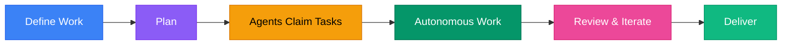


  Autonomous AI Teams  That Can Do Anything



  Deploy a team of AI agents that collaborate autonomously — engineering, research, content, operations, finance, or any workflow you define. Each agent has a real persona, persistent memory, and a full toolbox inside an isolated container. Self-hosted and free.







  {{< hextra/feature-card
    title="40x Token Efficiency"
    subtitle="Other tools waste 20,000 tokens reading files to understand a single function. DjinnBot does it in 500. The Code Knowledge Graph, Programmatic Tool Calling, and focused delegation keep context windows lean — so agents reason better and cost less."
    class="hx-aspect-auto md:hx-aspect-[1.1/1] max-md:hx-min-h-[340px]"
    icon="lightning-bolt"
    style="background: radial-gradient(ellipse at 50% 80%,rgba(16,185,129,0.15),hsla(0,0%,100%,0));"
  >}}
  
  
  
  
  
  
  
  
  
  
  


---

## More Done, Less Context

Most agent tools burn through context windows dumping raw files and verbose schemas into every turn. DjinnBot is engineered to minimize token waste &mdash; so agents spend context on <em>reasoning</em>, not reading.

  
40x

  
Understand a function and every caller &amp; callee

  

    Others
    
    ~20,000 tok
  

  

    DjinnBot
    
    ~500 tok
  

  
1 call to <code>code_graph_context</code> vs. 15+ file reads

  
37x

  
"What breaks if I change this service?"

  

    Others
    
    ~30,000 tok
  

  

    DjinnBot
    
    ~800 tok
  

  
1 call to <code>code_graph_impact</code> vs. codebase-wide grep + read

  
12x

  
30 tool schemas in the system prompt

  

    Others
    
    ~18,000 tok
  

  

    DjinnBot
    
    ~1,500 tok
  

  
Compact one-line Python signatures via Programmatic Tool Calling

  
24x

  
Read 5 files, grep for patterns, aggregate results

  

    Others
    
    ~12,000 tok
  

  

    DjinnBot
    
    ~500 tok
  

  
1 <code>exec_code</code> call &mdash; intermediate results stay in Python

  
13x

  
Analyze a 500-line diff for security issues

  

    Others
    
    ~4,000 tok
  

  

    DjinnBot
    
    ~300 tok
  

  
<code>focused_analysis</code> delegates to a sub-model &mdash; main context stays clean

Three systems make this possible:

**[Code Knowledge Graph](/docs/concepts/code-knowledge-graph)** &mdash; Tree-sitter parses every source file into a graph of functions, classes, call chains, and functional clusters stored in KuzuDB. Agents query the graph instead of reading files. One call returns what 15+ file reads would piece together.

**[Programmatic Tool Calling](/docs/concepts/programmatic-tool-calling)** &mdash; Instead of 30 full JSON schemas in every prompt, agents get compact Python function signatures and write code that calls tools, loops, and aggregates. Only the final result enters the context window.

**Focused Analysis** &mdash; When an agent needs to analyze a large diff or spec, `focused_analysis` delegates to a fast sub-model. The agent's context stays clean for high-level reasoning.

---

## How It Works

**1. Define the work** &mdash; describe what you need via the dashboard's guided onboarding, chat, or API. Software projects, research tasks, content campaigns, operations workflows &mdash; anything.

**2. Plan it** &mdash; the planning pipeline decomposes your project into tasks on a kanban board with priorities, dependencies, and hour estimates. Or define tasks manually.

**3. Agents claim tasks** &mdash; each agent watches specific board columns matching their role. Engineers grab implementation work. Reviewers grab review tasks. Any agent can be configured to watch any column.

**4. Autonomous work** &mdash; on pulse cycles, agents wake up, claim a task, spin up an isolated container, and do the work &mdash; writing code, researching topics, generating content, browsing the web, or running any tools you've given them. Use **swarm execution** for parallel multi-agent processing.

**5. Review & iterate** &mdash; agents review each other's work. If changes are needed, the task cycles back. They coordinate via inbox messages and can wake each other for urgent blockers.

**6. Deliver** &mdash; watch the whole thing happen in real-time via the dashboard, Slack, CLI, or the live activity feed.

---

## The Default Team

  

    Eric
    Product Owner
    Requirements, user stories, acceptance criteria, scope management
  

  

    Finn
    Solutions Architect
    System architecture, tech decisions, code review, API design
  

  

    Shigeo
    UX Specialist
    User flows, design systems, component specs, accessibility
  

  

    Yukihiro
    Senior SWE
    Implementation, bug fixes, writing production code
  

  

    Chieko
    Test Engineer
    QA strategy, regression detection, test automation
  

  

    Stas
    SRE
    Infrastructure, deployment, monitoring, incident response
  

  

    Yang
    DevEx Specialist
    CI/CD pipelines, tooling, developer workflow optimization
  

  

    Grace
    Executive Assistant
    Meeting transcripts, commitment tracking, relationship management
  

  

    Holt
    Marketing & Sales
    Sales strategy, outreach, deal management, positioning
  

  

    Luke
    SEO Specialist
    Content strategy, keyword research, technical SEO
  

  

    Jim
    Finance Lead
    Budget, pricing, runway management, financial modeling
  

Each agent has a 100-200 line personality file with backstory, core beliefs, productive flaws, and anti-patterns. The default team covers engineering, ops, marketing, SEO, and finance &mdash; but you can create agents for any domain by adding a directory with a few markdown files.

---

## Why Not the Alternatives?

  

    
    DjinnBot
    Everyone Else
  

  

    
Setup

    
One curl command &mdash; 5 minutes

    
IDE extension install, or hours of framework wiring

  

  

    
Token Efficiency

    
12-40x reduction via code graph, PTC, focused delegation

    
Raw file reads and full JSON schemas in every prompt

  

  

    
Cost Visibility

    
Per-call, per-agent, per-user LLM usage logs with dollar amounts

    
None, or basic aggregate totals

  

  

    
Agents

    
11 specialized agents with rich personas, or create your own

    
One generic assistant, or build from scratch

  

  

    
Security

    
Container isolation, 2FA, encrypted secrets, auto SSL

    
Direct host access

  

  

    
Memory

    
Persistent semantic memory with 3D knowledge graph

    
Stateless, or basic file-based context

  

  

    
Collaboration

    
Agents review, critique, and coordinate via work ledger

    
Single agent, single perspective

  

  

    
Parallelism

    
Swarm execution on DAG-aware task graphs

    
Sequential only, or custom scheduling code

  

  

    
Autonomy

    
Agents work 24/7 on configurable pulse schedules

    
Requires human in the loop

  

DjinnBot is built for people who want autonomous AI teams working on real projects &mdash; software, research, content, ops, or anything else &mdash; not another chatbot, not another framework to wire together.

