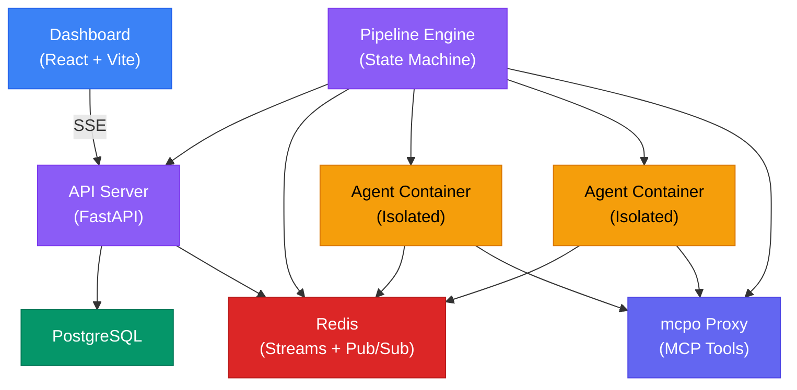

DjinnBot is a distributed system built around an event-driven architecture. Here's how the pieces fit together.

## System Overview



## Services

### API Server (Python / FastAPI)

The API server is the central coordination point. It provides:

- **REST API** — all CRUD operations for runs, pipelines, agents, projects, settings, memory, etc.
- **SSE streaming** — Server-Sent Events for real-time dashboard updates
- **Database access** — PostgreSQL via SQLAlchemy with Alembic migrations
- **GitHub webhooks** — receive events from GitHub for issue/PR integration
- **Chat management** — session lifecycle for interactive agent conversations

The API server does **not** execute agents. It stores state and serves the frontend.

### Pipeline Engine (TypeScript / Node.js)

The engine is the brain of the system. It:

- **Runs the state machine** — advances pipeline steps based on events
- **Spawns agent containers** — creates isolated Docker containers for each agent step
- **Manages memory** — loads/saves ClawVault memories for each agent session
- **Bridges Slack** — routes events to Slack threads and processes agent mentions
- **Manages MCP** — writes tool server config and monitors health via the McpoManager
- **Processes events** — subscribes to Redis Streams for reliable, ordered event delivery

The engine communicates with agent containers via Redis pub/sub — sending commands (run step, send message) and receiving events (output chunks, tool calls, completion).

### Dashboard (React / Vite / TanStack Router)

A single-page application built with:

- **React** with TypeScript
- **TanStack Router** for file-based routing
- **Tailwind CSS** for styling
- **SSE** for real-time streaming updates

The dashboard talks directly to the API server — there's no backend-for-frontend. It's served as static files by nginx in the Docker container.

### Redis (Event Bus)

Redis serves two roles:

1. **Streams** — reliable, ordered event delivery between the API server and engine. Events like `RUN_CREATED`, `STEP_QUEUED`, `STEP_COMPLETE` flow through Redis Streams.
2. **Pub/Sub** — real-time communication between the engine and agent containers. The engine sends commands, agents publish output chunks and events.

### PostgreSQL (State Store)

All persistent state lives in PostgreSQL:

- Pipeline run state and history
- Step outputs and timing
- Agent configuration
- Project boards and tasks
- Settings and provider configuration
- MCP server registry
- Chat session messages
- Secrets (encrypted at rest)

### Agent Containers

Each agent step spawns a fresh Docker container built from `Dockerfile.agent-runtime`. See [Agent Containers](/docs/concepts/containers) for details.

### mcpo Proxy

The [mcpo](https://github.com/skymoore/mcpo) proxy exposes MCP tool servers as REST/OpenAPI endpoints. See [MCP Tools](/docs/concepts/mcp-tools) for details.

## Event Flow

Here's what happens when you start a pipeline run:

1. **Dashboard** → `POST /v1/runs` → **API Server** creates run in PostgreSQL
2. **API Server** → publishes `RUN_CREATED` event → **Redis Streams**
3. **Engine** picks up event → creates run state machine → publishes `STEP_QUEUED` for first step
4. **Engine** → spawns **Agent Container** with persona, memories, and workspace
5. **Agent** executes step → streams output chunks via **Redis Pub/Sub** → **Engine** relays to **API Server** → **Dashboard** displays via SSE
6. **Agent** completes → **Engine** evaluates result → routes to next step (or branches, retries, loops)
7. Steps continue until pipeline completes or fails

## Tech Stack Summary

| Component | Technology | Language |
|-----------|-----------|---------|
| API Server | FastAPI, SQLAlchemy, Alembic | Python |
| Pipeline Engine | Custom state machine, Redis Streams | TypeScript |
| Dashboard | React, TanStack Router, Tailwind | TypeScript |
| Agent Runtime | pi-mono (pi-agent-core) | TypeScript |
| Agent Containers | Debian bookworm, full toolbox | Multi-language |
| Memory | ClawVault + QMDR | TypeScript |
| Event Bus | Redis Streams + Pub/Sub | — |
| Database | PostgreSQL 16 | — |
| MCP Proxy | mcpo | Python |
| Build System | Turborepo | — |
| Orchestration | Docker Compose | — |

## Monorepo Structure

DjinnBot is a Turborepo monorepo with npm workspaces:

```
packages/
├── core/            # Engine, events, memory, container management (TypeScript)
├── server/          # API server (Python/FastAPI)
├── dashboard/       # Web UI (React/TypeScript)
├── slack/           # Slack bridge and per-agent bots (TypeScript)
└── agent-runtime/   # Container entrypoint and tools (TypeScript)
```

The `core` package contains the bulk of the orchestration logic — the pipeline engine, Redis event bus, container runner, ClawVault memory integration, skill registry, MCP manager, chat session manager, and more.
