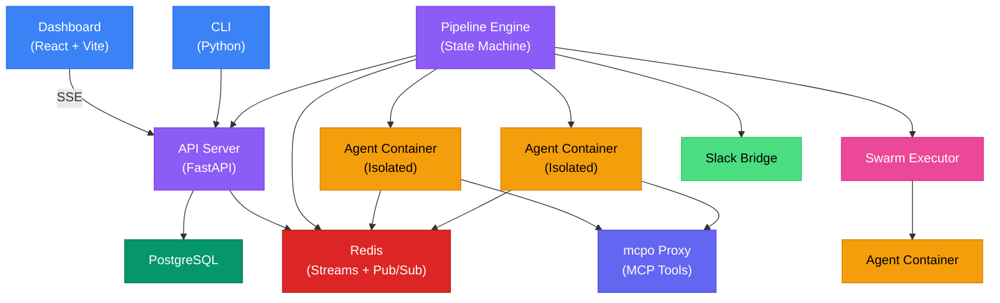
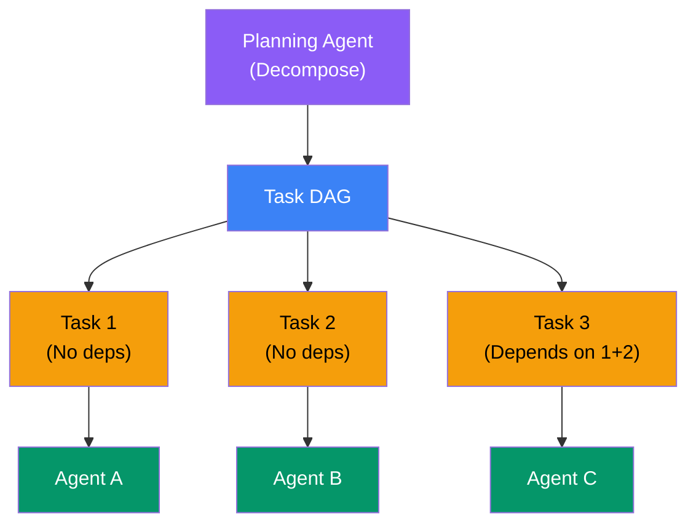
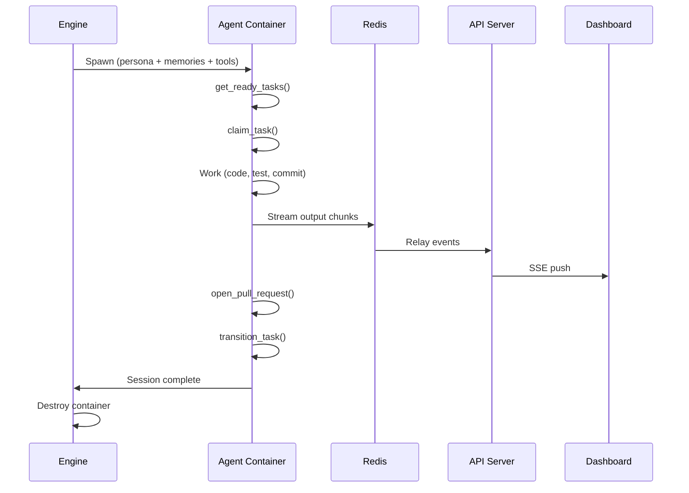

DjinnBot is a distributed system built around an event-driven architecture. Every component communicates through Redis — making it reliable, observable, and easy to extend.

## System Overview

## Services

### API Server (Python / FastAPI)

The API server is the central coordination point:

- **REST API** — CRUD operations for runs, pipelines, agents, projects, memory, users, admin, LLM calls, usage, swarms, and more (30+ routers)
- **SSE streaming** — Server-Sent Events for real-time dashboard updates (activity feed, run progress, swarm status, LLM call tracking)
- **Authentication** — JWT access/refresh tokens, TOTP 2FA, API keys, OIDC SSO
- **Database access** — PostgreSQL via SQLAlchemy with Alembic migrations
- **File handling** — attachment uploads with text extraction and image processing
- **GitHub webhooks** — receive events from GitHub for issue/PR integration
- **Ingest endpoint** — accept meeting transcripts and documents for Grace to process

The API server does **not** execute agents. It stores state, manages auth, and serves the frontend.

### Pipeline Engine (TypeScript / Node.js)

The engine is the brain of the system:

- **State machine** — advances pipeline steps based on events, handles branching, loops, and retries
- **Container orchestration** — creates isolated Docker containers for each agent step
- **Swarm executor** — parallel DAG-aware multi-task execution across multiple agents
- **Memory management** — loads/saves ClawVault memories for each agent session, runs memory consolidation
- **Pulse scheduler** — fires agent wake-up cycles on configurable schedules with named routines
- **Agent coordination** — work ledger, two-tier messaging, wake guardrails
- **Slack bridge** — routes events to Slack threads and processes agent mentions
- **MCP manager** — writes tool server config, monitors health, discovers tools
- **Container log streaming** — relays container logs to the admin panel via Redis
- **LLM call logging** — captures per-API-call token counts, latency, and cost data

The engine communicates with agent containers via Redis pub/sub — sending commands and receiving events (output chunks, tool calls, completion signals).

### Dashboard (React / Vite / TanStack Router)

A full-featured single-page application:

- **React** with TypeScript and TanStack Router (file-based routing)
- **Tailwind CSS** for styling
- **SSE** for real-time streaming (activity feed, run output, swarm progress, LLM tracking)
- **Three.js / WebGL** for 3D memory graph visualization
- **Admin panel** — container logs, LLM call log, API usage analytics, user management, notifications
- **Rich chat** — file uploads, image attachments, HTML previews, grouped tool calls
- **Swarm views** — DAG visualization, task detail, status bar, timeline

The dashboard talks directly to the API server. It's served as static files by nginx in the Docker container, with runtime API URL injection (no rebuild needed for custom domains).

### Swarm Executor

A parallel execution engine for running multiple agents concurrently:

The swarm executor:
1. Receives a DAG of tasks with dependency edges
2. Identifies tasks with no unmet dependencies
3. Spawns agent containers in parallel for ready tasks
4. Streams progress via SSE as tasks complete
5. Unlocks downstream tasks as dependencies are met
6. Handles failures and retries per-task

### Redis (Event Bus)

Redis serves two roles:

1. **Streams** — reliable, ordered event delivery between the API server and engine. Events like `RUN_CREATED`, `STEP_QUEUED`, `STEP_COMPLETE` flow through Redis Streams.
2. **Pub/Sub** — real-time communication between the engine and agent containers. The engine sends commands, agents publish output chunks and events.

### PostgreSQL (State Store)

All persistent state lives in PostgreSQL:

- Pipeline run state, step outputs, and timing
- Agent configuration and tool overrides
- Project boards, tasks, and dependencies
- User accounts, API keys, OIDC providers
- Chat sessions, messages, and attachments
- LLM call logs (per-API-call token/cost tracking)
- Memory scoring data
- Pulse routines and schedules
- Secrets (encrypted at rest with AES-256-GCM)
- Admin notifications
- Waitlist and onboarding state

### Agent Containers

Each agent step spawns a fresh Docker container built from `Dockerfile.agent-runtime`. See [Agent Containers](/docs/concepts/containers) for details.

### mcpo Proxy

The [mcpo](https://github.com/skymoore/mcpo) proxy exposes MCP tool servers as REST/OpenAPI endpoints. See [MCP Tools](/docs/concepts/mcp-tools) for details.

## Event Flow

### Pulse (Autonomous Work)

The primary workflow — agents pick up tasks from the board:

### Pipeline Runs

For structured workflows (planning, onboarding, engineering SDLC):

1. **Dashboard** → `POST /v1/runs` → **API Server** creates run in PostgreSQL
2. **API Server** → publishes `RUN_CREATED` event → **Redis Streams**
3. **Engine** picks up event → creates run state machine → publishes `STEP_QUEUED` for first step
4. **Engine** → spawns **Agent Container** with persona, memories, and workspace
5. **Agent** executes step → streams output via **Redis Pub/Sub** → **Engine** relays to **API** → **Dashboard** displays via SSE
6. **Agent** completes → **Engine** evaluates result → routes to next step (or branches, retries, loops)
7. Steps continue until pipeline completes or fails

### Swarm Runs

For parallel multi-task execution:

1. **Dashboard** → creates swarm via **API Server**
2. **Engine** → **Swarm Executor** receives task DAG
3. **Swarm Executor** → identifies ready tasks (no unmet dependencies) → spawns agent containers in parallel
4. Each agent works independently → streams output via Redis
5. On task completion → swarm executor unlocks downstream tasks → spawns more agents
6. Progress streams to dashboard via SSE (DAG visualization, timeline, status bar)

## Tech Stack Summary

| Component | Technology | Language |
|-----------|-----------|---------|
| API Server | FastAPI, SQLAlchemy, Alembic, JWT | Python |
| Pipeline Engine | Custom state machine, Redis Streams | TypeScript |
| Swarm Executor | DAG scheduler, parallel container orchestration | TypeScript |
| Dashboard | React, TanStack Router, Tailwind, Three.js | TypeScript |
| Agent Runtime | pi-mono (pi-agent-core) | TypeScript |
| Agent Containers | Debian bookworm, full toolbox | Multi-language |
| Memory | ClawVault + QMDR | TypeScript |
| Event Bus | Redis Streams + Pub/Sub | — |
| Database | PostgreSQL 16 | — |
| MCP Proxy | mcpo | Python |
| CLI | Click, Rich TUI | Python |
| Build System | Turborepo | — |
| Orchestration | Docker Compose | — |

## Monorepo Structure

DjinnBot is a Turborepo monorepo with npm workspaces:


  
    
      
    
    
      
    
    
      
    
    
      
    
    
      
    
  


The `core` package contains the bulk of the orchestration logic — the pipeline engine, Redis event bus, container runner, swarm executor, ClawVault memory integration, skill registry, MCP manager, chat session manager, pulse scheduler, agent coordination, and more.
