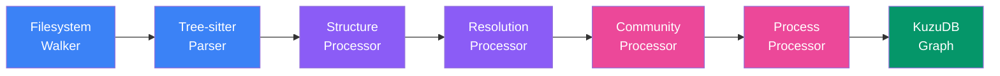

The Code Knowledge Graph gives agents deep, structural understanding of any codebase. Instead of relying solely on file search and grep, agents can query a graph of functions, classes, call relationships, execution flows, and functional clusters — enabling precise impact analysis and safer code changes.

## Why This Matters: One Tool Call vs. Many

Without the code graph, an agent trying to understand a function like `validateUser` needs to:

1. `grep` for the function definition — find which file it lives in
2. `read` the file to see the implementation
3. `grep` for all call sites — find every file that calls it
4. `read` each of those files to understand the callers
5. `grep` for what `validateUser` calls internally
6. `read` those files to understand the dependencies
7. Repeat for transitive callers and callees

That's easily **10-20 tool calls**, each returning full file contents that flood the context window. A 500-line file costs ~2,000 tokens. Reading 10 files to understand one function burns **20,000+ tokens** of context just on raw file contents — before the agent even starts reasoning.

With the code graph, the same question is **one tool call**:

```
code_graph_context(projectId, symbol_name="validateUser")
```

This returns a compact, structured response: who calls `validateUser`, what it calls, which execution flows it participates in, which functional cluster it belongs to, and the file/line locations of every related symbol. The same information that took 20,000+ tokens now fits in **500-1,000 tokens** — a 20-40x reduction.

The impact is even more dramatic for broader questions. "What breaks if I change `AuthService`?" without the graph requires manually tracing every consumer across the entire codebase. With the graph:

```
code_graph_impact(projectId, target="AuthService", direction="upstream")
```

One call. The graph traversal happens server-side in the KuzuDB query engine, and the agent gets back a structured list of affected symbols grouped by severity — not raw file dumps.

## How It Works

The code graph is built by an indexing pipeline that runs against a project's git workspace:



{}

### Filesystem Walk

Discovers all source files in the project workspace, filtering by supported language extensions and respecting `.gitignore` patterns.

### Tree-sitter Parsing

Parses each source file using language-specific [Tree-sitter](https://tree-sitter.github.io/tree-sitter/) grammars. Extracts functions, classes, methods, interfaces, structs, enums, imports, and other structural elements with precise line-number locations.

### Structure Processing

Builds `CONTAINS` and `DEFINED_IN` relationships between files, folders, and code symbols. Creates the initial graph topology.

### Resolution Processing

Resolves `CALLS`, `IMPORTS`, and `USES` relationships between symbols by analyzing call sites, import statements, and type references. Cross-file references are resolved using a symbol table built during parsing.

### Community Detection

Groups related symbols into functional clusters using the Louvain algorithm. Each community is auto-labeled with a heuristic name (e.g., "Authentication Middleware", "Database Connection Pool") based on the symbols it contains. Communities help agents understand the logical architecture of a codebase.

### Process Discovery

Traces execution flows (cross-function call chains) and identifies intra-community and cross-community processes. These represent the "how things work together" layer on top of the structural "what exists" layer.

{}

## Supported Languages

The code graph uses Tree-sitter grammars for precise AST parsing. Supported languages:

| Language | Extensions |
|----------|-----------|
| TypeScript | `.ts`, `.tsx` |
| JavaScript | `.js`, `.jsx`, `.mjs`, `.cjs` |
| Python | `.py` |
| Go | `.go` |
| Rust | `.rs` |
| Java | `.java` |
| C | `.c`, `.h` |
| C++ | `.cpp`, `.cc`, `.cxx`, `.hpp`, `.hh` |
| C# | `.cs` |
| PHP | `.php` |

## Graph Storage

The graph is stored in [KuzuDB](https://kuzudb.com/), an embedded graph database. Each project gets its own KuzuDB instance stored alongside the project workspace. KuzuDB supports Cypher queries, enabling both the built-in API endpoints and ad-hoc exploration.

### Node Types

The graph contains these node types:

- **File**, **Folder** — filesystem structure
- **Function**, **Class**, **Method**, **Interface** — primary code symbols
- **Struct**, **Enum**, **Trait**, **Impl**, **Namespace**, **TypeAlias** — language-specific constructs
- **Variable**, **Decorator**, **Import**, **Const**, **Property** — extended elements
- **Community** — functional clusters discovered by community detection
- **Process** — execution flows traced through the call graph

### Relationship Types

- `CONTAINS` — folder/file/class containment
- `DEFINED_IN` — symbol defined in file
- `CALLS` — function/method call
- `IMPORTS` — import/require statement
- `USES` — type reference or usage
- `BELONGS_TO` — symbol membership in a community
- `PARTICIPATES_IN` — symbol involvement in a process

## Agent Tools

Agents interact with the code graph through four tools, available during both chat and pulse sessions:

### `code_graph_query`

Search the codebase knowledge graph with natural language or keywords. Returns matching functions, classes, and execution flows.

```
code_graph_query(projectId, query="authentication middleware", limit=10)
```

Use this to understand how code works together before making changes.

### `code_graph_context`

Get complete context for a specific code symbol: who calls it, what it calls, which execution flows it participates in, and which functional cluster it belongs to.

```
code_graph_context(projectId, symbol_name="validateUser", file_path="src/auth.ts")
```

Use after `code_graph_query` to deeply understand a specific symbol.

### `code_graph_impact`

Analyze what would break if you change a symbol. Returns affected symbols grouped by depth (d=1: WILL BREAK, d=2: LIKELY AFFECTED) plus affected execution flows.

```
code_graph_impact(projectId, target="AuthService", direction="upstream", max_depth=3)
```

Use BEFORE making changes to understand risk. `upstream` means "what depends on this", `downstream` means "what this depends on".

### `code_graph_changes`

Map current uncommitted git changes to affected code symbols and execution flows. Acts as a pre-commit safety check.

```
code_graph_changes(projectId)
```

## Indexing

### Triggering an Index

Code graph indexing can be triggered in three ways:

1. **Dashboard** — on the project's Code tab, click **Index Codebase**
2. **API** — `POST /v1/projects/{project_id}/knowledge-graph/index`
3. **Automatic** — the engine triggers re-indexing via a Redis event when the project workspace changes

Indexing runs as a background job. Progress is tracked per-phase (filesystem walk, parsing, structure, resolution, community detection, process discovery) and visible in the dashboard.

### Re-indexing

Subsequent index runs detect changes since the last index and update incrementally where possible. Use `force: true` to rebuild from scratch.

## Dashboard Visualization

The project's **Code** tab shows an interactive graph visualization powered by [Sigma.js](https://www.sigmajs.org/):

- **Node coloring** — symbols colored by community membership
- **Layout** — force-directed layout with community clustering
- **Zoom and pan** — explore large codebases interactively
- **Node details** — click any node to see its properties, relationships, and source location
- **Community view** — toggle to see community-level architecture
- **Process view** — visualize execution flows through the codebase

## API Endpoints

```
GET    /v1/projects/{id}/knowledge-graph/status           # Index status
POST   /v1/projects/{id}/knowledge-graph/index            # Trigger indexing
GET    /v1/projects/{id}/knowledge-graph/index/{job_id}   # Job progress
GET    /v1/projects/{id}/knowledge-graph/graph-data        # Full graph data
GET    /v1/projects/{id}/knowledge-graph/communities       # Community list
GET    /v1/projects/{id}/knowledge-graph/processes         # Process list
POST   /v1/projects/{id}/knowledge-graph/query             # Search
GET    /v1/projects/{id}/knowledge-graph/context/{symbol}  # Symbol context
POST   /v1/projects/{id}/knowledge-graph/impact            # Impact analysis
GET    /v1/projects/{id}/knowledge-graph/changes           # Change mapping
POST   /v1/projects/{id}/knowledge-graph/cypher            # Raw Cypher query
```
