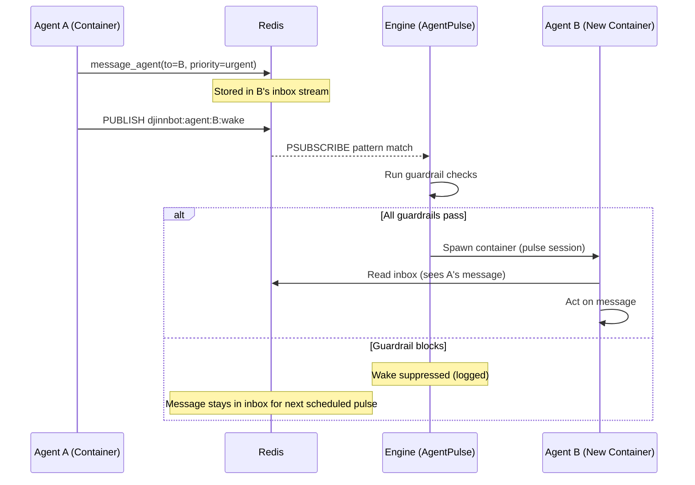
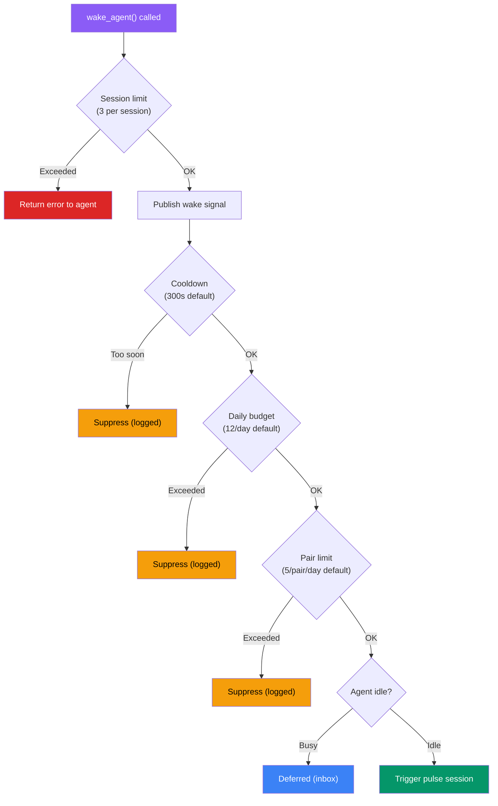

Agents in DjinnBot don't just work on schedules -- they can wake each other up on demand. When one agent discovers a blocker, a critical finding, or needs immediate help from another agent, it can trigger an out-of-band pulse session for the target. This is the event-driven complement to the scheduled [Pulse Mode](/docs/concepts/pulse) system.

The wake system is designed with layered guardrails at every level to prevent runaway execution, infinite loops, and cost blowouts.

## Two Communication Modes

Agents have two tools for inter-agent communication, with very different costs and semantics:

| Tool | Delivery | Cost | Use Case |
|------|----------|------|----------|
| `message_agent` | Inbox (next pulse) | Free | Status updates, FYI messages, non-blocking requests |
| `wake_agent` | Immediate (triggers pulse) | Expensive | Blockers, critical findings, user-requested urgency |

`message_agent` drops a message into the target agent's Redis Stream inbox. The target reads it on their next scheduled pulse -- no extra compute is consumed. This is the default and preferred mode.

`wake_agent` does the same thing, but _also_ publishes a wake signal that triggers an immediate pulse session for the target agent. This spins up a container, loads the agent's persona, runs an LLM session, and then destroys the container. It's the equivalent of tapping someone on the shoulder versus leaving a note on their desk.

### When to Wake

The `wake_agent` tool enforces structured reasoning by requiring a `reason` parameter:

```typescript
wake_agent({
  to: "finn",
  message: "Auth middleware is rejecting all tokens after the Redis upgrade. Blocking my OAuth implementation.",
  reason: "blocker"        // "blocker" | "critical_finding" | "user_request"
})
```

Agents are instructed to prefer `message_agent` for everything that can wait until the next pulse cycle.

## How Wake Signals Flow

The wake system uses Redis Pub/Sub as a lightweight signaling layer on top of the inbox system:



Key detail: even when a wake is suppressed by guardrails, the message is never lost. It sits in the target's inbox stream and will be picked up on the next scheduled pulse cycle.

### Signal Path

1. **Agent calls `wake_agent`** -- the agent-runtime publishes an `agentMessage` event with `priority: urgent` via Redis
2. **Engine receives the event** -- the `onMessageAgent` handler stores the message in the target's inbox via `AgentInbox.send()`
3. **Engine publishes wake signal** -- `AgentInbox.publishWake()` publishes to `djinnbot:agent:{targetId}:wake`
4. **AgentPulse receives the signal** -- the wake listener (Redis `PSUBSCRIBE` on `djinnbot:agent:*:wake`) picks it up
5. **Guardrails evaluate** -- four checks run in sequence (see below)
6. **Pulse triggers** -- if all checks pass, `AgentPulse.triggerPulse()` runs a standard pulse session for the target

High-priority `message_agent` calls (priority `high` or `urgent`) also publish wake signals automatically -- agents don't need to use `wake_agent` explicitly for urgent inbox messages.

## Guardrail Layers

The wake system has **four layers of guardrails** that run in sequence. A wake is suppressed at the first failure, and the reason is logged.

### Layer 1: Per-Session Rate Limit (Agent-Side)

Before the wake signal even leaves the container:

```
Max 3 wake_agent calls per session
```

This is enforced in the agent runtime itself. Once an agent exhausts its wake budget for the session, the tool returns an error instructing it to use `message_agent` instead. This prevents a single runaway session from flooding wake signals.

### Layer 2: Cooldown Period (Engine-Side)

```yaml
cooldown_seconds: 300    # 5 minutes between wakes per target agent
```

Tracked in-memory per agent. If Agent B was last woken 2 minutes ago, a new wake signal for B is suppressed regardless of who sent it. This prevents rapid-fire wakes from multiple sources.

### Layer 3: Daily Wake Budget (Engine-Side)

```yaml
max_wakes_per_day: 12    # Per target agent
```

Tracked in Redis with daily counters (`djinnbot:agent:{id}:wakes:{date}`). Keys auto-expire after 48 hours. When a wake would exceed the daily budget, the counter is rolled back and the wake is suppressed.

### Layer 4: Per-Pair Daily Limit (Engine-Side)

```yaml
max_wakes_per_pair_per_day: 5    # Per source->target combination
```

This is the loop breaker. Tracked in Redis per source-target pair per day (`djinnbot:agent:{target}:wakes_from:{source}:{date}`). If Yukihiro has already woken Finn 5 times today, the 6th attempt is blocked -- even if Finn's overall daily budget hasn't been reached.

This specifically prevents the scenario where two agents get into a conversation loop: A wakes B, B processes and wakes A, A wakes B again, etc.

### Layer 5: Idle Gate (Engine-Side)

```
Agent must be in "idle" state
```

If the target agent is already running (state `working`, `thinking`, or `tool_calling`), the wake is deferred. The message stays in the inbox and will be processed when the agent's current session ends or on the next scheduled pulse.

### Guardrail Summary



In every suppression case, the underlying inbox message is preserved. Guardrails only prevent the _immediate wake_ -- they never drop messages.

## Configuration

Wake guardrails are configured per-agent in `config.yml` under the `coordination` block:

```yaml
coordination:
  max_concurrent_pulse_sessions: 2
  wake_guardrails:
    cooldown_seconds: 300              # Min time between wakes
    max_daily_session_minutes: 120     # Total daily runtime cap
    max_wakes_per_day: 12              # Daily wake limit
    max_wakes_per_pair_per_day: 5      # Per source-target pair
```

These can also be edited through the dashboard (**Agents > Settings**) and updated at runtime via the API without restarting the engine.

### Tuning Guidelines

| Scenario | Adjustment |
|----------|------------|
| Cost-sensitive deployment | Lower `max_wakes_per_day` to 4-6, increase `cooldown_seconds` to 600+ |
| Fast iteration (active development) | Increase `max_wakes_per_day` to 20+, lower `cooldown_seconds` to 60 |
| Agent keeps waking the same target | Lower `max_wakes_per_pair_per_day` to 2-3 |
| Agents never wake each other | Ensure `pulse_enabled: true` and messages use `priority: high` or `urgent` |

### Monitoring

The dashboard exposes wake stats per agent via the API:

```
GET /v1/agents/{agentId}/wake-stats
```

Returns:

```json
{
  "wakesToday": 4,
  "maxWakesPerDay": 12,
  "cooldownSeconds": 300,
  "lastWakeTime": 1740000000000,
  "maxDailySessionMinutes": 120
}
```

Use this to monitor which agents are consuming their wake budgets and adjust guardrails accordingly.

## Interaction with Scheduled Pulses

Event-driven wakes and scheduled pulses are independent but coordinated:

- **Scheduled pulses** fire on a timer (e.g., every 30 minutes) regardless of wake activity
- **Wake-triggered pulses** fire immediately but share the same concurrency and budget limits
- Both types read the inbox -- a scheduled pulse will process messages that arrived between cycles, including those from suppressed wakes
- Both respect `pulse_blackouts` -- wakes during blackout windows are suppressed
- Both count toward `max_concurrent_pulse_sessions` -- a wake won't spawn a container if the agent is already at their concurrency limit

This means the system is self-healing: even if every wake signal is suppressed, messages still flow through the inbox and get processed on the next scheduled pulse.

## Real-World Scenarios

### Scenario 1: Yukihiro Hits a Blocker

Yukihiro (Senior SWE) is implementing an OAuth feature and discovers the auth middleware is broken after a Redis upgrade. He needs Finn (Solutions Architect) to look at it:

1. Yukihiro calls `wake_agent(to="finn", message="Auth middleware broken after Redis upgrade", reason="blocker")`
2. Message lands in Finn's inbox with `priority: urgent`
3. Wake signal published to `djinnbot:agent:finn:wake`
4. Engine checks guardrails -- Finn is idle, within budget, no cooldown active
5. Finn's pulse fires immediately. He reads the urgent message, investigates, and either fixes the issue or messages Yukihiro back with guidance

### Scenario 2: Loop Prevention

Chieko (Test Engineer) wakes Yukihiro about a failing test. Yukihiro fixes it and wakes Chieko to re-run tests. Chieko finds another failure and wakes Yukihiro again. This continues:

- Wake 1: Chieko -> Yukihiro (allowed)
- Wake 2: Yukihiro -> Chieko (allowed)
- Wake 3: Chieko -> Yukihiro (allowed)
- Wake 4: Yukihiro -> Chieko (allowed)
- Wake 5: Chieko -> Yukihiro (allowed, pair limit at 5)
- Wake 6: Chieko -> Yukihiro (**suppressed** -- pair limit reached)

At this point, Chieko's message still reaches Yukihiro's inbox. He'll see it on his next scheduled pulse in at most 30 minutes. The ping-pong stops consuming immediate compute, but communication continues.

### Scenario 3: Cost Control

A deployment goes wrong and Stas (SRE) starts waking multiple agents for help:

- Stas -> Yukihiro (wake 1 of 12 for Yukihiro today)
- Stas -> Finn (wake 1 of 12 for Finn today)
- Stas -> Yang (wake 1 of 12 for Yang today)

Each target agent has an independent daily budget. If Stas tries to wake Yukihiro 13 times in one day, the 13th wake is suppressed. And Stas himself is rate-limited to 3 `wake_agent` calls per session, so he'd need multiple pulse cycles to approach these limits.
