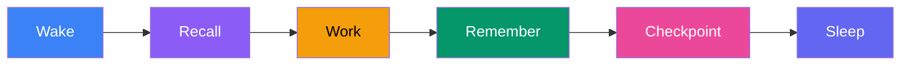

DjinnBot agents have persistent memory that survives across sessions. They remember decisions, learn from mistakes, and build knowledge over time. Unlike most AI tools that start every session from scratch, DjinnBot agents accumulate experience — and that experience makes them more effective with every interaction.

Memory is powered by [ClawVault](https://github.com/koi-labs-org/clawvault) with semantic search via [QMDR](https://github.com/uf-hy/qmdr).

## How It Works

Every agent has two memory vaults:

- **Personal vault** (`data/vaults/<agent-id>/`) — private memories only this agent can access
- **Shared vault** (`data/vaults/shared/`) — team-wide knowledge all agents can read and write

Memories are stored as markdown entries with metadata (type, tags, timestamps) and connected via wiki-links for graph traversal.

## Memory Lifecycle



1. **Wake** — when an agent session starts, ClawVault loads relevant memories into context
2. **Recall** — during execution, agents search memories semantically before making decisions
3. **Remember** — agents save important findings, decisions, and lessons
4. **Checkpoint** — during long sessions, memories are periodically saved
5. **Sleep** — on session end, a summary is saved with next steps

## Memory Tools

### recall — Search Memories

```javascript
recall("search query", { limit: 5, profile: "default" })
```

Profiles optimize retrieval for different contexts:

| Profile | Use Case |
|---------|---------|
| `default` | General purpose retrieval |
| `planning` | Task planning and project context |
| `incident` | Errors, bugs, and lessons learned |
| `handoff` | Session continuity information |

### remember — Save to Vault

```javascript
remember(type, "Title", "Content with details", {
  shared: true,     // Share with all agents
  tags: ["tag1"]    // For search filtering
})
```

Memory types:

| Type | When to Use |
|------|------------|
| `lesson` | Learned from a mistake or success |
| `decision` | Important choice with rationale |
| `pattern` | Recurring approach that works |
| `fact` | Important information about the project/team |
| `preference` | How someone or something prefers to work |
| `handoff` | Context for resuming work later |
| `commitment` | Promises made with deadlines (used by Grace) |
| `relationship` | People, connections, affiliations (used by Grace) |

## Wiki-Link Knowledge Graph

Memories are connected using `[[wiki-link]]` syntax, creating a traversable knowledge graph:

```javascript
remember("decision", "MyApp: Tech Stack",
  "[[Project: MyApp]] will use FastAPI + PostgreSQL. " +
  "Considered Django (rejected: too opinionated) and Express (rejected: need Python). " +
  "See also [[MyApp: Architecture]], [[MyApp: API Design]].",
  { shared: true, tags: ["project:myapp", "architecture"] }
)
```

These links create a web of connected knowledge. When an agent recalls context about a project, they start from `[[Project: Name]]` and follow links to discover related information — tech stack decisions, architectural patterns, past bugs, team preferences, and more.

### The Anchor Pattern

Every project should have a root anchor memory that links to all related knowledge:

```javascript
remember("fact", "Project: MyApp",
  "Root anchor for project MyApp.\n" +
  "Goal: [[MyApp: Goal]]\n" +
  "Tech: [[MyApp: Tech Stack]]\n" +
  "Scope: [[MyApp: V1 Scope]]",
  { shared: true, tags: ["project:myapp", "project-anchor"] }
)
```

Subsequent memories link back to the anchor, keeping the graph connected and navigable.

## Memory Scoring

Not all memories are equally useful. DjinnBot's memory scoring system automatically weights memories by:

- **Recency** — recently accessed memories rank higher
- **Frequency** — frequently recalled memories are more important
- **Relevance** — semantic similarity to the current context
- **Importance** — explicitly tagged high-importance items

Memory scoring is configured through the dashboard (**Settings > Memory Scoring**) and affects how `recall()` ranks results. This means agents naturally prioritize recent, relevant knowledge without manual curation.

## 3D Knowledge Graph Visualization

The dashboard includes an interactive 3D visualization of the memory knowledge graph, powered by Three.js and WebGL:

- **Nodes** represent individual memories, colored by type
- **Edges** represent wiki-link connections between memories
- **Clusters** emerge naturally around projects, people, and topics
- **Interactive** — rotate, zoom, click nodes to inspect memories, filter by agent or type

This visualization makes it easy to understand how your team's knowledge connects and identify gaps or orphaned memories. Access it from the **Memory** page in the dashboard.

## Automatic Memory Consolidation

During session teardown (particularly Slack sessions), DjinnBot automatically consolidates memories:

1. Reviews the session's conversation and decisions
2. Extracts key learnings, decisions, and action items
3. Stores them as structured memories with proper wiki-links
4. Avoids duplicating existing memories by searching first

This means that even casual Slack conversations contribute to the team's knowledge base without any manual effort.

## Semantic Search

Memory search uses embeddings for semantic similarity, not just keyword matching. When an agent calls `recall("how we handle authentication")`, it finds memories about auth patterns even if they don't contain the exact word "authentication."

The search pipeline:

{}

### Query expansion

The query is expanded to capture related concepts.

### Embedding

Query is converted to a vector via `text-embedding-3-small`.

### Retrieval

Nearest neighbors found in the SQLite-backed vector store.

### Reranking

Results are reranked using `gpt-4o-mini` for relevance, weighted by memory scores.

### Injection

Top results are injected into the agent's context.

{}

All embedding and reranking runs through OpenRouter — no local GPU or model downloads required.

## Browsing Memory

You can browse and search agent memories through:

- **Dashboard** — the Memory page with 2D and 3D graph views, semantic search, and per-agent filtering
- **CLI** — `djinn memory search "architecture decisions" --agent finn`
- **API** — `GET /v1/memory/search?agent_id=eric&query=architecture`
