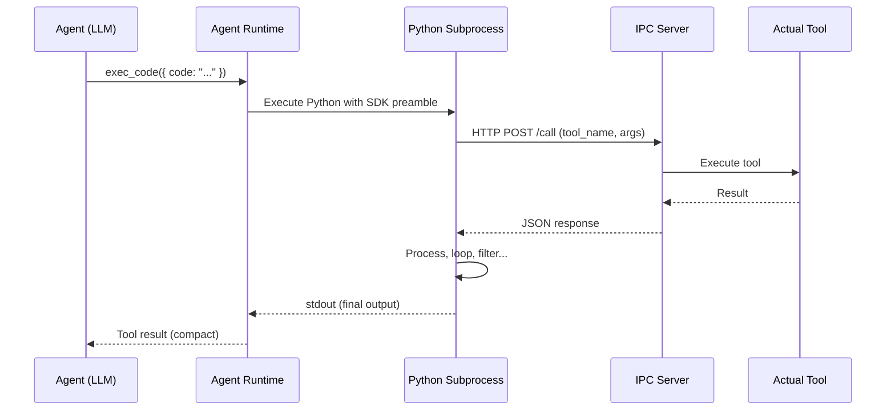

Programmatic Tool Calling (PTC) is an optimization that reduces LLM context usage by 30-40%+ by replacing JSON tool schemas with a compact Python SDK. Instead of sending full parameter schemas for every tool in the prompt, the agent gets a single `exec_code` tool and writes Python code to call tools programmatically.

## The Problem

With standard tool calling, every tool's full JSON schema is included in the system prompt. For an agent with 30+ tools (built-in + MCP), this can consume 15,000-25,000 tokens of context window before the agent even starts working. That's expensive, and it crowds out space for actual task context.

Additionally, intermediate tool results (file contents, search results, command output) accumulate in the conversation history, further inflating context usage.

## How PTC Works

PTC splits tools into two categories:

| Category | In Prompt | Called Via | Examples |
|----------|-----------|-----------|----------|
| **Direct** | Full JSON schema | Normal tool call | `complete`, `fail`, `onboarding_handoff` |
| **PTC** | Compact one-line signature | `exec_code` Python | `bash`, `read`, `write`, `recall`, `web_search`, all MCP tools |

Direct tools are lifecycle tools that signal step completion or agent handoff — they must be called as deliberate, single-shot decisions. Everything else becomes a PTC tool.

### What the Agent Sees

Instead of 30 full JSON schemas, the agent sees:

1. **2-3 direct tools** with full schemas (`complete`, `fail`)
2. **One `exec_code` tool** whose description contains compact function signatures for all PTC tools

The compact reference looks like:

```
bash(command: str, timeout?: int) -> str
read(file_path: str) -> str
write(file_path: str, content: str) -> str
recall(query: str, limit?: int) -> str
web_search(query: str, num_results?: int) -> str
code_graph_query(projectId: str, query: str, limit?: int) -> str
```

### What Happens at Runtime

When the agent calls `exec_code` with Python code:

1. The code is written to a temp file inside the container
2. A Python subprocess executes it with a pre-generated SDK preamble
3. The SDK provides `async` function stubs that communicate with a Node.js IPC server via HTTP
4. The IPC server dispatches actual tool calls and returns results
5. The Python code can loop, filter, aggregate — whatever it needs
6. Only the final `print()` output goes back into the LLM's context window



### Benefits

1. **Context reduction** — tool schemas take ~80% less space as compact signatures
2. **Intermediate results stay out of context** — the agent writes code that processes tool results in Python, only returning what matters
3. **Multi-step workflows in one turn** — read 5 files, grep for patterns, aggregate results, all in a single `exec_code` call instead of 5+ tool call rounds
4. **MCP tool efficiency** — MCP tools often have verbose schemas; PTC compresses them dramatically

## Configuration

PTC is controlled by environment variables in the agent container:

| Variable | Default | Description |
|----------|---------|-------------|
| `PTC_ENABLED` | `false` | Enable Programmatic Tool Calling |
| `PTC_TIMEOUT` | `120` | Default timeout for `exec_code` in seconds |

To enable PTC globally, add to your `.env`:

```bash
PTC_ENABLED=true
```

Or enable it per-agent by setting the environment variable in the agent's container configuration.

## Tool Classification

The classifier uses a simple rule set:

- Tools in the `DIRECT_ONLY_TOOLS` set (`complete`, `fail`, `onboarding_handoff`) always stay as direct JSON tool calls
- MCP tools (identified by `__` in the name, e.g., `github__list_issues`) are always PTC
- Everything else defaults to PTC

This means the agent only sees 2-3 tool schemas in its prompt regardless of how many tools are available.

## The IPC Bridge

The IPC server runs on a random port inside each agent container. It:

- Accepts HTTP POST requests from the Python subprocess
- Maps tool names to actual `AgentTool` instances
- Executes tools and returns results as JSON
- Publishes tool call events to Redis for dashboard visibility
- Supports hot-reload when MCP tools refresh mid-session

The IPC server is automatically started when PTC is enabled and shut down when the agent session ends.
