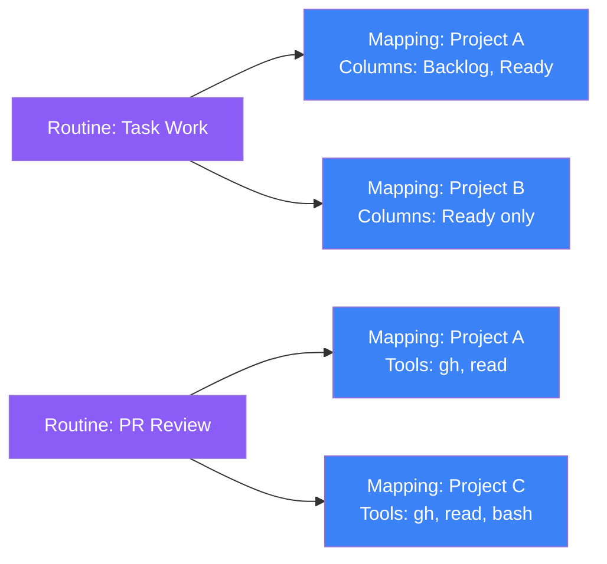

Pulse mode is what makes DjinnBot agents truly autonomous. Instead of waiting for commands, agents wake up on a schedule — checking their inbox, finding tasks, and doing work without human intervention. This is how your AI team works while you sleep.

## How Pulse Works

When pulse mode is enabled for an agent, the engine wakes them up on a configurable interval (default: every 30 minutes). Each pulse cycle is driven by the agent's **PULSE.md** file — a fully customizable markdown file that defines the agent's wake-up routine.

The file is injected as part of the agent's system prompt during pulse sessions. Whatever instructions you write become the agent's autonomous behavior. The engine doesn't hard-code the routine — it's entirely defined by the markdown file you provide.

### Default Pulse Routine

The default template (`agents/_templates/PULSE.md`) covers:

{}

### Check inbox

Read messages from other agents and prioritize urgent items.

### Search memories

Recall recent context, handoffs, and active work.

### Discover projects

Call `get_my_projects()` to find assigned projects.

### Check work queue

Call `get_ready_tasks(projectId)` to find tasks in assigned columns.

### Claim a task

`claim_task(projectId, taskId)` atomically assigns the task and provisions a git workspace.

### Do the work

Implement the task in the provisioned workspace — write code, run tests, use tools.

### Open a PR

`open_pull_request(projectId, taskId, title, body)` when ready.

### Transition the task

Move it through the kanban board (e.g., to "review").

### Report if needed

Message the human via Slack DM if there's something urgent.

{}

But you can rewrite `PULSE.md` to do anything — check monitoring dashboards, run reports, review PRs, triage issues, process meeting transcripts, or follow any custom workflow you define.

## Named Pulse Routines

Agents can have **multiple named pulse routines** with independent schedules, models, and behavior. This is configured through the dashboard or API — each routine runs on its own timer and can use a different model than the agent's default.

**Example use cases:**

| Routine | Schedule | Model | What It Does |
|---------|----------|-------|-------------|
| Task Work | Every 30 min | Kimi K2.5 | Check board, claim tasks, write code |
| PR Review | Every 60 min | Claude Opus | Review open PRs, provide feedback |
| Regression Scan | Daily at 2am | GPT-4o | Run full test suite, report failures |
| Commitment Check | Every 2 hours | Grok | Check for overdue follow-ups (Grace) |

Routines are managed via the dashboard (**Agents > Pulse Routines**) or the API (`/v1/pulse-routines`). Each routine can have its own model override, enabling cost-efficient scheduling — use a fast model for frequent lightweight checks and a powerful model for deep analysis.

## Routine-to-Project Mapping

Routines can be mapped to specific projects with per-project configuration overrides. This creates a **many-to-many relationship**: one agent can have multiple routines, and each routine can be mapped to multiple projects with different settings per project.

### Three layers of configuration



1. **Pulse Routine** — the agent-level definition with default instructions, schedule, model, tools, and columns
2. **Project-Agent-Routine Mapping** — the join table that maps a routine to a specific project, with optional overrides for columns and tools
3. **Resolved Config** — the effective configuration after merging routine defaults with project-specific overrides

### Override resolution

When the engine fires a routine, it resolves the effective configuration for each project:

| Setting | Priority |
|---------|----------|
| **Columns** | Mapping `columnIds` > routine `pulse_columns` > all project columns |
| **Tools** | Mapping `toolOverrides` > routine `tools` > agent default tools |
| **Models** | Routine `planningModel` / `executorModel` > agent config defaults |

### Example: One agent, two behaviors

Yukihiro (Senior SWE) has two routines mapped to two different projects:

| Routine | Project | Columns | Model |
|---------|---------|---------|-------|
| Task Work | MyApp | Backlog, Ready | Kimi K2.5 (fast) |
| Task Work | InternalTool | Ready only | Kimi K2.5 (fast) |
| PR Review | MyApp | Review | Claude Opus (thorough) |

Each combination runs on its own schedule with its own tools and model — all configured through the dashboard.

### API

Mappings are managed under each project:

- `GET /v1/projects/{project_id}/agents/{agent_id}/routines` — list mappings
- `POST /v1/projects/{project_id}/agents/{agent_id}/routines` — create mapping
- `PUT /v1/projects/{project_id}/agents/{agent_id}/routines/{mapping_id}` — update
- `DELETE /v1/projects/{project_id}/agents/{agent_id}/routines/{mapping_id}` — remove
- `GET /v1/projects/{project_id}/agents/{agent_id}/routines/resolve` — resolve effective config

## Configuration

Pulse is configured per-agent in `config.yml`:

```yaml
pulse_enabled: true
pulse_interval_minutes: 30
pulse_columns:              # Which kanban columns this agent checks
  - Backlog
  - Ready
pulse_container_timeout_ms: 120000
pulse_max_consecutive_skips: 5
pulse_offset_minutes: 3     # Stagger to avoid all agents waking simultaneously
pulse_blackouts:
  - label: Nighttime
    start_time: '23:00'
    end_time: '07:00'
    type: recurring
pulse_transitions_to:       # Allowed kanban transitions
  - planning
  - ready
  - in_progress
```

All settings can be edited through the dashboard agent configuration page.

## Agent Coordination

When multiple agents pulse simultaneously, coordination prevents conflicts:

### Wake Guardrails

```yaml
coordination:
  max_concurrent_pulse_sessions: 2    # Max containers at once
  wake_guardrails:
    cooldown_seconds: 300              # Minimum time between wakes
    max_daily_session_minutes: 120     # Daily runtime cap
    max_wakes_per_day: 12              # Daily wake limit
    max_wakes_per_pair_per_day: 5      # Prevent agent-to-agent loops
```

These limits are critical for production deployments — they prevent runaway costs and ensure agents don't get stuck in infinite communication loops.

### Plan + Execute Model

For complex tasks, agents use a two-stage delegation pattern where a planner agent writes a detailed brief, then spawns a separate executor in a fresh container with a clean context window.

#### How it works

1. **Planner** runs first using the `planning_model` (typically a fast/cheap model). It reads the task, analyzes the codebase, and formulates a plan.

2. **Planner calls `spawn_executor()`** — a tool that:
   - Takes a `projectId`, `taskId`, and a complete `executionPrompt` written by the planner
   - POSTs to `/v1/internal/spawn-executor`, which creates a fresh run and dispatches it to a new container
   - Blocks and polls every 2 seconds until the executor completes, fails, or times out
   - Returns structured results (commit hashes, files changed, deviations, blockers) back to the planner

3. **Executor** runs in a separate container with:
   - ONLY the execution prompt — no conversation history, no context pollution
   - The task's git workspace pre-mounted
   - The `executor_model` (typically a more capable model)
   - A set of **deviation rules** that govern how it handles unexpected situations

#### Deviation Rules

Every executor session is injected with strict deviation rules:

| Rule | Trigger | Action |
|------|---------|--------|
| **Rule 1: Auto-fix bugs** | Code doesn't work (errors, wrong output, type errors) | Fix inline, commit with `fix:` prefix |
| **Rule 2: Add missing guards** | Missing error handling, validation, auth checks | Add the code, commit with `fix:` prefix |
| **Rule 3: Fix blockers** | Missing dependency, broken import, build config error | Fix the blocker, commit with `chore:` prefix |
| **Rule 4: STOP for architecture** | Needs new DB table, schema migration, library switch, breaking API change | Call `fail()` with a proposal — do NOT implement |

Limits:
- Max 3 auto-fix attempts per issue
- Only fix issues caused by the executor's own changes
- Out-of-scope work is noted but not done

#### Configuration

```yaml
# In agent config.yml
planning_model: openrouter/x-ai/grok-4.1-fast
executor_model: openrouter/anthropic/claude-sonnet-4
```

Per-routine model overrides are also supported — see [Routine-to-Project Mapping](#routine-to-project-mapping) below.

#### Why this matters

The separation achieves three things:
1. **Cost efficiency** — fast models handle planning, capable models only fire for implementation
2. **Context hygiene** — the executor gets a clean context window with only the execution prompt, avoiding the "lost in conversation" problem
3. **Structured handoff** — the planner writes a complete brief as if briefing a skilled engineer with zero prior context, forcing thorough task decomposition

## Project Tools

During pulse sessions, agents have access to project management tools:

| Tool | Purpose |
|------|---------|
| `get_my_projects()` | List assigned projects |
| `get_ready_tasks(projectId)` | Find tasks in your columns |
| `claim_task(projectId, taskId)` | Claim a task + provision git workspace |
| `get_task_context(projectId, taskId)` | Full task details and acceptance criteria |
| `open_pull_request(projectId, taskId, title, body)` | Open a GitHub PR |
| `transition_task(projectId, taskId, status)` | Move task through kanban |
| `execute_task(projectId, taskId)` | Kick off a pipeline run for the task |

## Git Workflow

When an agent claims a task, the system:

1. Creates a feature branch: `feat/task_abc123-implement-oauth`
2. Provisions a git workspace at `/home/agent/task-workspaces/{taskId}/`
3. Configures git credentials for push access

The agent works in this workspace, commits, pushes, and opens a PR — all within the isolated container.

## Blackout Windows

Prevent agents from pulsing during certain times:



```yaml
pulse_blackouts:
  - label: Nighttime
    start_time: '23:00'
    end_time: '07:00'
    type: recurring
  - label: Weekend Evenings
    start_time: '20:00'
    end_time: '08:00'
    type: recurring
```


```yaml
pulse_blackouts:
  - label: Holiday Freeze
    start_time: '2026-12-23T00:00:00'
    end_time: '2026-12-27T00:00:00'
    type: one_off
```



## Communication

Agents can communicate during pulse sessions:

- **`message_agent(agentId, message)`** — send a message to another agent's inbox with priority and type
- **`slack_dm(message)`** — message the human via Slack DM (use sparingly — only for urgent findings or blockers)

## Customizing Pulse Behavior

Edit `agents/<id>/PULSE.md` to change what an agent does when it wakes up. For example, a QA agent might:

```markdown
# Pulse Routine

### 1. Check for open PRs that need review
Search for PRs assigned to you or your team.

### 2. Run regression tests
Execute the test suite and report any failures.

### 3. Review recently merged code
Check for untested code paths in recent merges.
```

Or Grace (Executive Assistant) checks for overdue commitments and surfaces proactive context:

```markdown
# Pulse Routine

### 1. Search for overdue commitments
recall("commitment deadline", { limit: 10 })

### 2. Check for pending follow-ups
recall("follow-up needed", { limit: 10 })

### 3. Alert if needed
Only message the user when there are actionable items.
```

The flexibility is total — any workflow you can describe in markdown becomes autonomous agent behavior.
