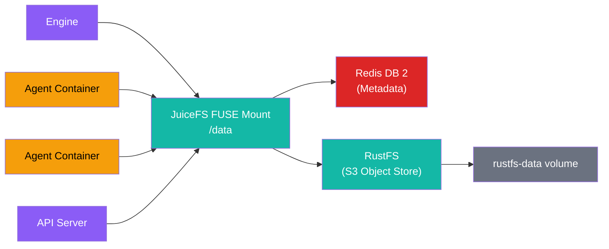

DjinnBot uses a distributed storage stack to share files across all containers — the engine, API server, and every dynamically spawned agent container see the same filesystem at `/data`. This is built on two components: **RustFS** for S3-compatible object storage and **JuiceFS** for presenting that storage as a standard POSIX directory tree.

## Architecture



### RustFS

[RustFS](https://github.com/rustfs/rustfs) is an S3-compatible object storage server written in Rust. It holds the actual file data.

- Runs as `djinnbot-rustfs` with a persistent Docker volume (`rustfs-data`)
- Exposes S3 API on port 9000 (internal network only)
- Exposes an admin console on port 9001 (exposed to host for debugging)
- Authenticated with `RUSTFS_ACCESS_KEY` and `RUSTFS_SECRET_KEY`

### JuiceFS

[JuiceFS](https://juicefs.com) is a POSIX-compliant distributed filesystem that sits on top of any object store. It runs as a FUSE mount inside a privileged container.

- Runs as `djinnbot-juicefs` using the `juicedata/mount:ce-v1.3.1` image
- **Metadata engine**: Redis DB 2 (separate from the event bus on DB 0)
- **Data backend**: RustFS at `http://rustfs:9000/djinnbot`
- **Mount point**: `/jfs` inside the container, exposed via the `juicefs-data` Docker named volume

On startup, the container runs two commands:

1. `juicefs format` (idempotent) — creates the filesystem metadata if it doesn't exist
2. `juicefs mount` — mounts the FUSE filesystem with production-tuned options

### Mount options

```
--cache-dir /var/jfsCache     # Local SSD cache for read performance
--cache-size 20480            # 20 GB cache (configurable via JUICEFS_CACHE_SIZE)
--buffer-size 300             # 300 MB write buffer
--prefetch 1                  # Prefetch 1 block ahead
--max-uploads 20              # 20 concurrent uploads to RustFS
--attr-cache 1                # 1 second attribute cache
--entry-cache 1               # 1 second directory entry cache
--dir-entry-cache 1           # 1 second directory listing cache
--backup-meta 3600            # Backup metadata every hour
--trash-days 7                # Soft-delete retention
```

## What Lives on JuiceFS

Everything under `/data` is on JuiceFS:

```
/data/
├── workspaces/                   ← project repos (cloned from GitHub)
│   ├── {projectId}/              ← bare git repo per project
│   └── .runs/                    ← ephemeral run worktrees
│       └── {runId}/              ← git worktree for a pipeline run
├── sandboxes/                    ← persistent agent home directories
│   └── {agentId}/                ← symlinked to /home/agent in containers
│       ├── clawvault/            ← memory vaults
│       │   ├── {agentId}/        ← personal vault
│       │   └── shared/           ← team shared vault
│       └── task-workspaces/      ← persistent task worktrees (pulse)
│           └── {taskId}/         ← git worktree for a pulse task
├── cookies/                      ← browser cookie files for authenticated browsing
│   ├── _staging/                 ← master copies uploaded via extension/dashboard
│   │   └── ck_xxx.txt            ← Netscape-format cookie file
│   └── {agentId}/                ← per-agent copies (mounted read-only in containers)
│       └── ck_xxx.txt
└── uploads/                      ← file attachments
```

## How Containers Access It

The `juicefs-data` Docker named volume is mounted at `/data` in the engine, API server, and messaging bridge containers. When the engine spawns agent containers dynamically via the Docker API, it mounts the same volume.

Agent containers have their sandbox mounted via JuiceFS `--subdir` at `/home/agent`, which maps to `/data/sandboxes/{agentId}/`. This gives each agent a persistent home directory that survives container destruction.

## Health Monitoring

The API server health endpoint (`/v1/health`) checks both storage components:

```json
{
  "storage": {
    "juicefs_mounted": true,
    "rustfs_healthy": true,
    "juicefs_volume": "djinnbot"
  }
}
```

The CLI `djinn status` command also reports JuiceFS and RustFS health.

## Durability

- **File data** is stored in the `rustfs-data` Docker volume and persists across container restarts and rebuilds
- **Filesystem metadata** is stored in Redis DB 2 and backed up hourly by JuiceFS (`--backup-meta 3600`)
- **Soft deletes** are retained for 7 days (`--trash-days 7`)
- Storage volumes are explicitly preserved during `djinn update` — only application containers are rebuilt

## Configuration

Storage credentials are set via environment variables (see `.env.example`):

```bash
RUSTFS_ACCESS_KEY=djinnbot-rustfs-admin
RUSTFS_SECRET_KEY=djinnbot-rustfs-secret
JUICEFS_VOLUME_NAME=djinnbot
JUICEFS_CACHE_SIZE=20480   # MB
```
