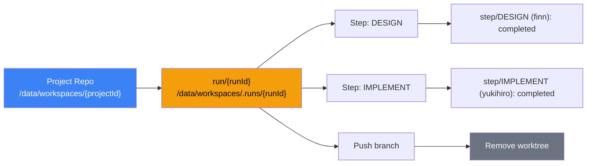
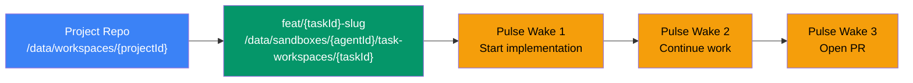

DjinnBot uses two workspace management strategies to give agents isolated working directories. The strategy is selected per-project and determines how files are organized, versioned, and shared across runs.

## Workspace Strategies

### Git Worktree (`git_worktree`)

The default for projects linked to a GitHub repository. Uses git's native [worktree](https://git-scm.com/docs/git-worktree) feature to create isolated working directories that share a single `.git` object store.

- Each pipeline run or pulse task gets its own worktree with its own branch
- Multiple agents can work on different branches of the same project simultaneously without conflicts
- Changes are committed per step and pushed to the remote
- Worktrees are cleaned up after runs complete

### Persistent Directory (`persistent_directory`)

For non-git projects (content pipelines, research, simple kanban boards). The project workspace is a plain directory that persists across runs.

- The run workspace IS the project workspace — agents work directly in it
- Files accumulate across runs with no version control
- No branch isolation, no commit history, no push
- Useful when git overhead isn't needed

The engine selects the workspace manager based on the project's `workspaceType` setting. Projects with a linked repository default to `git_worktree`; projects without a repo can be explicitly set to `persistent_directory`.

## Pipeline vs Pulse Workspaces

The git worktree manager creates workspaces differently depending on whether the session is a pipeline run or a pulse task.

### Pipeline runs — ephemeral worktrees



- **Branch**: `run/{runId}` — ephemeral, one per run
- **Location**: `/data/workspaces/.runs/{runId}/`
- **Container mounts**: `/home/agent/run-workspace/` (the worktree) + `/home/agent/project-workspace/` (read-only reference to the project repo)
- **Lifecycle**: Created when run starts, auto-committed after each step, pushed to remote on completion, worktree removed after finalization
- **Isolation**: Each run is fully isolated — a failed run doesn't affect main or other runs
- **Remote**: Optional. If no remote exists, the worktree is cleaned up and work stays local

### Pulse sessions — persistent task worktrees



- **Branch**: `feat/{taskId}-{slug}` — persistent, named after the task (e.g., `feat/task_abc123-implement-oauth-login`)
- **Location**: `/data/sandboxes/{agentId}/task-workspaces/{taskId}/`
- **Container mount**: `/home/agent/task-workspaces/{taskId}/`
- **Lifecycle**: Created when an agent claims a task. Persists across pulse wake-ups. Removed explicitly when the task is closed or the PR is merged.
- **Cross-run continuity**: The branch accumulates commits across multiple wake-ups. If another agent or pipeline run pushed to the same branch, the latest is fetched and checked out.
- **Remote**: **Required**. The manager throws an error if the project has no linked repository, since pulse work can't be pushed without a remote.

### Comparison table

| Aspect | Pipeline Runs | Pulse Sessions |
|--------|--------------|----------------|
| Branch naming | `run/{runId}` | `feat/{taskId}-{slug}` |
| Workspace location | `/data/workspaces/.runs/{runId}/` | `/data/sandboxes/{agentId}/task-workspaces/{taskId}/` |
| Container mount path | `/home/agent/run-workspace/` | `/home/agent/task-workspaces/{taskId}/` |
| Branch lifecycle | Created and destroyed per run | Persists across wakes, reused until task closes |
| Auto-cleanup | Yes, after push/finalization | No. Removed explicitly via `removeTaskWorktree()` |
| Remote required | No (skips push if absent) | Yes (throws if missing) |
| Stale lock cleanup | No | Yes (removes `index.lock` left by killed containers) |
| Cross-run continuity | None — starts from main each time | Full — branch accumulates commits |
| Method | `createRunWorktreeAsync()` | `createTaskWorktree()` |

## Concurrency and Locking

The `GitWorktreeWorkspaceManager` serializes all git operations per-project using an in-memory mutex (`projectLocks`). Multiple concurrent `worktree add`, `worktree remove`, or `pull` operations on the same `.git` directory would race on the ref database. The lock chains them sequentially while allowing operations on different projects to run in parallel.

## Corruption Detection

The manager validates worktrees by checking that `.git` in the workspace is a **file** (a pointer back to the parent repo), not a **directory**. If an agent runs `git init` inside a worktree (which creates a `.git` directory), the manager detects the corruption and refuses to reuse the workspace, requiring the run to be recreated.

## GitHub Authentication

Workspace operations that interact with a remote repository use GitHub App installation tokens when available:

1. **Project-level token** — fast path using the `ProjectGitHub` database record
2. **Repo-level token** — fallback that resolves the installation from the GitHub API by repository URL
3. **Environment token** — last resort using the `GITHUB_TOKEN` environment variable

Tokens are fetched via the API server (`/v1/github/projects/{id}/git-token` or `/v1/github/repo-token`) and used for clone, pull, and push operations. The authenticated URL is temporarily set on the remote, then restored to the clean URL after the operation — credentials are never persisted in git config.

## Swarm Branch Integration

After a swarm completes parallel work across multiple executor branches, the workspace manager can merge them into a single target branch:

```
feat/{taskId}-taskA  ──┐
feat/{taskId}-taskB  ──┼──> feat/{taskId}  (target)
feat/{taskId}-taskC  ──┘
```

The `mergeBranches()` method creates a temporary worktree, performs sequential merges, pushes the result, and cleans up. Conflicts are reported per-branch so the caller can decide how to proceed.
