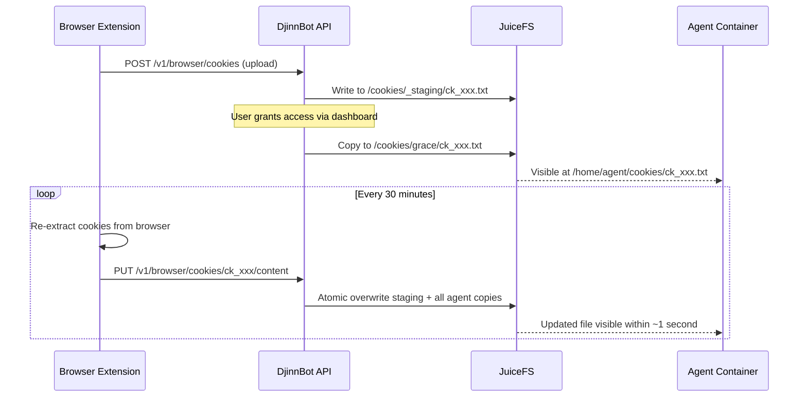

DjinnBot agents can browse authenticated websites using your real browser cookies. The **Cookie Bridge** browser extension exports cookies from your browser, pushes them to the DjinnBot API, and keeps them fresh with automatic periodic syncing. Granted agents see updated cookies in their container within seconds — no restart needed.


This feature requires the [Camofox](/docs/concepts/mcp-tools) browser tool, which is built into every agent container. Agents use the `camofox_import_cookies` tool to load cookies into their headless browser session.


## How It Works



1. The extension extracts cookies for a domain (including HttpOnly cookies)
2. Cookies are uploaded to the API in Netscape cookie format
3. You grant specific agents access via the dashboard
4. The extension automatically re-syncs every 30 minutes
5. On each sync, the API atomically overwrites the file in every granted agent's JuiceFS directory
6. Running agent containers see the updated file within ~1 second (JuiceFS cache TTL)

## Install the Browser Extension

The Cookie Bridge extension is available for Chrome and Firefox. Download the latest `.zip` from the [GitHub Releases](https://github.com/BaseDatum/DjinnBot/releases) page.

### Chrome

{}

### Download the extension

Download `djinnbot-cookie-bridge-chrome.zip` from the latest release.

### Load in Chrome

1. Go to `chrome://extensions`
2. Enable **Developer mode** (toggle in top right)
3. Click **Load unpacked**
4. Select the extracted `chrome/` directory (or drag the zip)

### Configure

Click the extension icon and enter your DjinnBot API URL (e.g., `http://localhost:8000`) and optionally an API key.

{}

### Firefox

{}

### Download the extension

Download `djinnbot-cookie-bridge-firefox.zip` from the latest release.

### Load in Firefox

1. Go to `about:debugging#/runtime/this-firefox`
2. Click **Load Temporary Add-on**
3. Select the `.zip` file or the `manifest.json` inside the extracted directory

### Configure

Click the extension icon and enter your DjinnBot API URL and optionally an API key.

{}

## Export Cookies

{}

### Select a domain

Click the extension icon, enter a domain (e.g., `linkedin.com`), or click one of the quick-select buttons. Give it a name like "LinkedIn".

### Send to DjinnBot

Click **Send to DjinnBot**. The extension extracts all cookies for that domain (including HttpOnly ones that JavaScript can't access) and uploads them to the API.

The site is automatically added to the **Tracked Sites** list for periodic auto-sync.

### Grant access to agents

Open the DjinnBot dashboard, go to **Browser Cookies**, select an agent, and click **Grant** next to the cookie set. The cookie file is immediately placed in the agent's container filesystem.

{}

## Auto-Sync

Once a site is tracked, the extension automatically re-extracts and pushes fresh cookies:

- **Every 30 minutes** via a background alarm
- **On browser startup** — catches staleness from overnight closure
- **Manual sync** — click "Sync" on any tracked site, or "Sync All"

The extension popup shows each tracked site with:

- A **status dot** — green (synced), red (error), grey (disconnected)
- **Last sync time** — when cookies were last pushed
- **Sync** and **Remove** buttons

If a cookie set is deleted on the server (via dashboard or CLI), the extension marks the site as "disconnected" and stops syncing it.

## How Agents Use Cookies

Inside the container, cookie files appear at `/home/agent/cookies/`. Agents use the `camofox_import_cookies` tool to load them:

```
camofox_import_cookies(cookiesPath: "ck_abc123def456.txt", domainSuffix: ".linkedin.com")
```

The agent's system prompt includes instructions to check for cookie files before browsing authenticated sites. The filename is auto-generated (`ck_` prefix + random ID), but agents can list the directory to discover available files.

## Dashboard Management

The **Browser Cookies** page in the dashboard provides:

- **Upload** — manually upload a Netscape-format `.txt` file
- **Cookie sets list** — shows name, domain, cookie count, creation date, and last sync time
- **Agent permissions** — select an agent and grant/revoke access to specific cookie sets

When a cookie set has been updated via the extension's auto-sync, the dashboard shows the last sync timestamp.

## CLI

The `djinnbot cookies` CLI also supports the full workflow:

```bash
# List cookie sets
djinnbot cookies list

# Upload from file
djinnbot cookies upload cookies.txt --name LinkedIn

# Export from local browser (Chrome/Firefox)
djinnbot cookies export --domain linkedin.com --output linkedin.txt

# Grant/revoke
djinnbot cookies grant grace ck_abc123
djinnbot cookies revoke grace ck_abc123

# List grants for an agent
djinnbot cookies grants grace
```

## File Sharing Architecture

Cookie files are shared between the API server and agent containers via JuiceFS — the same distributed filesystem used for all DjinnBot persistent storage. See [Storage Layer](/docs/concepts/storage) for the full architecture.

### Write Path

When cookies are uploaded or synced:

1. The API server writes the file to `/jfs/cookies/_staging/{filename}` using **atomic writes** (write to temp file, then `os.rename()`)
2. On grant (or sync update), the file is atomically copied to `/jfs/cookies/{agentId}/{filename}` for each granted agent
3. Both writes go through the API server's JuiceFS FUSE mount, which commits metadata to Redis and data to RustFS

### Read Path

Agent containers mount a JuiceFS subdirectory read-only:

```
juicefs mount --subdir /cookies/{agentId} --read-only ... /home/agent/cookies
```

This is an independent FUSE mount from the agent's home directory (`/home/agent`). The read-only flag prevents agents from modifying or deleting cookie files.

### Consistency

JuiceFS clients use a 1-second metadata cache (`--attr-cache 1`, `--entry-cache 1`). When the API server writes an updated cookie file, agent containers see the new version within approximately 1 second — no container restart or notification needed.

Atomic writes (`temp + rename`) ensure that agents never read a partially-written cookie file, even if the update happens while the agent is actively reading.
