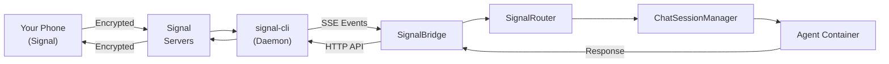

DjinnBot's Signal integration lets you message your agents from Signal — the privacy-focused, end-to-end encrypted messenger. Signal uses a shared phone number model: one Signal account is linked to DjinnBot, and incoming messages are routed to agents based on context, commands, or sender defaults.


Signal integration is **optional**. The built-in dashboard chat works without any Signal configuration. Set this up only if you want to reach agents via Signal.


## Overview

Signal works differently from Slack, Discord, and Telegram:

- **Shared phone number** — one Signal account for all agents, not one bot per agent
- **Smart routing** — messages are routed to agents via sticky sessions, explicit commands, per-sender defaults, or a fallback agent
- **Linked device** — DjinnBot links as a secondary device to an existing Signal account (like linking Signal Desktop)
- **signal-cli** — runs as a daemon inside the engine container, communicating via HTTP API and SSE events

## Prerequisites

- A phone number with an active Signal account on a primary device (your phone)
- DjinnBot must be running

That's it. DjinnBot links as a secondary device — your existing Signal account on your phone continues to work normally.

## Step 1: Link DjinnBot to Signal

{}

### Open the Dashboard

Navigate to **Settings > Integrations > Signal**.

### Start Linking

Click **Link Device**. DjinnBot will display a QR code.

### Scan with Signal

On your phone, open Signal:
1. Go to **Settings > Linked Devices**
2. Tap **Link New Device**
3. Scan the QR code from the dashboard

### Wait for Provisioning

After scanning, Signal provisions the linked device. This takes 10-30 seconds. The dashboard will update to show the linked phone number.

{}

Behind the scenes, the dashboard sends an RPC request through Redis to the SignalBridge, which calls `signal-cli startLink` to generate the provisioning URI, then `signal-cli finishLink` to complete it after you scan the QR code.

## Step 2: Enable the Integration

After linking, Signal is linked but not yet active. To start routing messages:

1. In **Settings > Integrations > Signal**, toggle **Enabled** to ON
2. Select a **Default Agent** (the fallback for messages that don't match a routing rule)
3. Set the **Sticky TTL** (how long conversations stay routed to an agent after the last message — default 30 minutes)
4. Save

The engine transitions from receive-only mode (keeping the linked device active) to full mode (SSE listener + message routing).

## Step 3: Set Up Allowlists

Control who can message your agents via Signal:

1. In **Settings > Integrations > Signal**, configure the **Allowlist**
2. Add phone numbers in E.164 format (e.g., `+15551234567`)
3. Optionally assign a **default agent** per phone number
4. Or toggle **Allow All** for open access

Unrecognized senders are silently ignored.

## How Signal Routing Works

Since Signal uses a shared phone number, the SignalRouter determines which agent handles each message:

| Priority | Method | Example |
|----------|--------|---------|
| 1 | **Sticky session** | You talked to Finn 5 minutes ago — new messages continue going to Finn |
| 2 | **Explicit command** | Send `/agent yukihiro` to switch to Yukihiro |
| 3 | **Per-sender default** | Your phone number has "Eric" set as default in the allowlist |
| 4 | **Global fallback** | The configured default agent handles it |

### Built-in Commands

| Command | Description |
|---------|-------------|
| `/agent <name>` | Switch to a specific agent |
| `/agents` | List all available agents |
| `/help` | Show available commands |

## Signal Architecture

The signal-cli daemon runs as a child process inside the engine container:

- **HTTP API** (port 8820, localhost only) — used for sending messages, managing accounts
- **SSE stream** — receives incoming messages as Server-Sent Events
- **Redis distributed lock** — ensures only one engine instance runs the daemon
- **JuiceFS storage** — signal-cli data persists at `/data/signal/data` across container restarts

## Environment Variables

| Variable | Default | Description |
|----------|---------|-------------|
| `SIGNAL_DATA_DIR` | `/jfs/signal/data` | Path to signal-cli data directory on JuiceFS |
| `SIGNAL_CLI_PATH` | `signal-cli` | Path to signal-cli binary |
| `SIGNAL_HTTP_PORT` | `8820` | HTTP API port for signal-cli daemon |

These are usually left at their defaults. The engine's `docker-compose.yml` already maps them.

## Unlinking

To unlink DjinnBot from your Signal account:

1. Go to **Settings > Integrations > Signal** in the dashboard
2. Click **Unlink**

Or from your phone: Signal > Settings > Linked Devices > remove the DjinnBot device.

## Troubleshooting

### "Could not acquire Signal lock"

- Another engine instance is already running the signal-cli daemon. Only one instance can hold the lock at a time. Stop the other instance or wait for the lock TTL to expire (30s).

### Messages not being received

- Check that Signal is **Enabled** (not just linked) in the dashboard
- Verify the sender's phone number is on the allowlist (or Allow All is on)
- Check engine logs: `docker compose logs engine | grep -i signal`
- Verify the SSE stream is connected: look for `[SignalBridge] Connecting SSE stream...`

### QR code expired during linking

- QR codes expire after ~60 seconds. Click **Link Device** again to generate a fresh one.

### signal-cli daemon won't start

- Check that Java is available in the engine container (signal-cli requires it)
- Verify the signal-cli binary exists at the configured path
- Check engine logs for startup errors

### Messages sent but no response

- Confirm the ChatSessionManager is injected (look for `[SignalBridge] ChatSessionManager injected` in logs)
- Check that the default agent is set and exists in the agent registry

## Signal Resources

- [Signal](https://signal.org/) — the Signal messenger
- [signal-cli](https://github.com/AsamK/signal-cli) — the CLI client used by DjinnBot
- [Signal Linked Devices](https://support.signal.org/hc/en-us/articles/360007320551-Linked-Devices)
